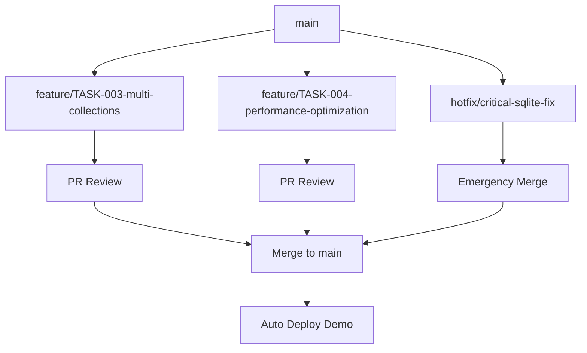
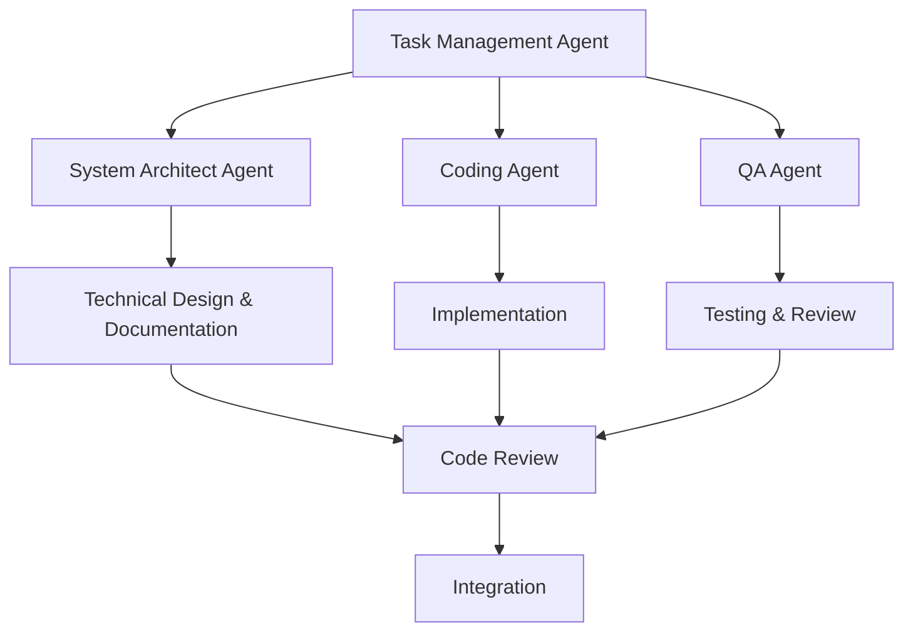
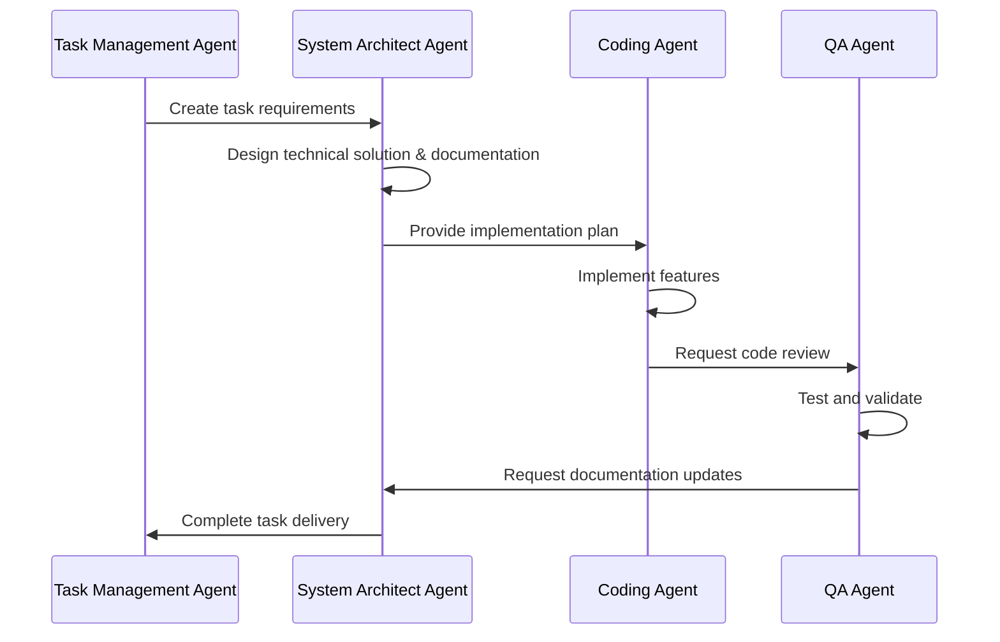

# CLAUDE.md

This file provides guidance for Claude Code (claude.ai/code) when working with code in this repository.

**IMPORTANT**: This file defines development processes and architectural principles for LocalRetrieve. Follow these instructions precisely to ensure code quality and consistency.

## Project Overview

LocalRetrieve is a browser-based hybrid search library using SQLite WASM with the sqlite-vec extension. It provides sql.js compatible Database interface with vector search capabilities that persist in the browser using OPFS (Origin Private File System).

### Current Status
- **MVP Progress**: 85% complete (10/12 tickets) - **UPDATED**: Export/Import and Demo completed
- **Production Ready**: Core functionality fully implemented
- **Architecture Ready**: Foundation for multi-collections prepared
- **Documentation**: See /doc/ for product vision, /tasks/ for work structure

### Documentation Integration
- **Product Vision**: `/doc/vision.md` - strategic goals and positioning
- **Target Architecture**: `/doc/target_architecture.md` - technical vision
- **Work Plan**: `/tasks/initial_stage/mvp_work_breakdown.md` - task structure
- **README.md**: User documentation and API reference

## Development Processes (SDLC)

### Branching Strategy and Workflow

**Branching Model**: Feature Branch + Pull Request workflow



**Branching Rules**:
- `main` - stable production branch
- `feature/TASK-ID-description` - new feature development
- `hotfix/critical-issue-name` - critical fixes
- `docs/update-readme` - documentation-only updates

### Task Management

**Directory Structure /tasks/**:
```
/tasks/
├── current_stage/              # Active sprint
│   └── README.md              # Sprint overview
├── TASK-001-export-import/    # ✅ COMPLETED
├── TASK-002-demo-completion/  # ✅ COMPLETED
├── TASK-003-multi-collections/ # Individual task directories
│   ├── requirements.md        # Requirements analysis
│   ├── design.md             # Technical design
│   ├── breakdown.md          # Detailed work breakdown
│   ├── progress.md           # Implementation progress
│   └── docs/                 # Task-specific documentation
├── backlog/                   # Future tasks
└── templates/                 # Templates for new tasks
```

**Task Creation Process**:
1. **Requirements Analysis** → Create `/tasks/TASK-ID-name/requirements.md`
2. **Technical Design** → Add `design.md` with architecture decisions
3. **Work Breakdown** → Create `breakdown.md` with development steps
4. **Branch Creation** → `git checkout -b feature/TASK-ID-name`
5. **Implementation** → Incremental development with commits
6. **Code Review** → Pull Request with task links
7. **Integration** → Merge to main with ticket closure

### Quality Standards

**Code Requirements**:
- TypeScript strict mode mandatory
- All public methods must have JSDoc comments
- Tests required for new functionality
- Architectural decisions documented in comments

**Review Process**:
- Minimum 1 reviewer for regular changes
- Architectural changes require design review
- All PRs must pass CI/CD checks
- Demo must work after every merge

**Pull Request Template**:
```markdown
## Overview
Brief description of changes and ticket relation

## Related Tasks
- Fixes #TASK-ID
- Related to /tasks/TASK-ID-name/

## Type of Changes
- [ ] Bug fix
- [ ] New feature
- [ ] Architectural change
- [ ] Documentation update

## Testing
- [ ] Unit tests added/updated
- [ ] Integration tests passed
- [ ] Demo works correctly
- [ ] Cross-browser testing completed

## Checklist
- [ ] Code follows project standards
- [ ] Comments added for complex logic
- [ ] Documentation updated if needed
- [ ] No breaking changes (or marked)
```

### CI/CD Pipeline

**PR Creation Checks**:
1. TypeScript compilation
2. Linting and formatting
3. Unit tests
4. WASM and SDK build
5. Browser integration tests

**After merge to main**:
1. Full build and testing
2. Demo application deployment
3. Documentation updates
4. Team notifications

### Release Process

**Versioning**: Semantic versioning (semver)
- `0.x.y` - MVP phase (current)
- `1.0.0` - First stable release
- `1.x.y` - Backward compatible changes

**Release Process**:
1. Create branch `release/v1.0.0`
2. Finalize changes and documentation
3. Test release candidate
4. Create tag and GitHub Release
5. Publish to NPM (when ready)

## Agent Role Model

### Agent Architecture

LocalRetrieve development uses specialized AI agents for different aspects of the software development lifecycle:



### Agent Definitions and Requirements

#### 1. Task Management Agent
**Purpose**: Oversee project workflow, sprint planning, and task coordination
**Responsibilities**:
- Sprint planning and task prioritization
- Progress tracking and milestone management
- Resource allocation and timeline estimation
- Risk assessment and mitigation planning

**Required Capabilities**:
- Access to project documentation (`/doc/`, `/tasks/`)
- Understanding of development process and SDLC
- Ability to create and update task structures
- Integration with branching and PR workflows

**Current Status**: **MISSING** - Need to implement
**Implementation**: Create specialized agent with project management capabilities

#### 2. System Architect Agent (universal-dev-architect)
**Purpose**: Technical architecture decisions, system design, and documentation
**Responsibilities**:
- High-level system architecture design
- Technical decision documentation
- Integration patterns and API design
- Performance and scalability considerations
- API documentation and technical writing
- Architecture documentation maintenance

**Required Capabilities**:
- Deep understanding of browser technology stack
- SQLite WASM and Worker architecture expertise
- Vector search and database optimization knowledge
- BDD-style requirement analysis
- Technical writing and API documentation
- Architecture documentation and diagramming

**Current Status**: **AVAILABLE** - universal-dev-architect agent
**Enhancement Needed**:
- Vector search optimization expertise
- Browser persistence patterns (OPFS, IndexedDB)
- Technical documentation and API writing skills

#### 3. Coding Agent (polyglot-architect-developer)
**Purpose**: Implementation of designed features and components
**Responsibilities**:
- Step-by-step implementation planning
- Code writing following design specifications
- Unit test creation and implementation
- Integration with existing codebase

**Required Capabilities**:
- TypeScript/JavaScript expertise
- SQLite and WASM development
- Browser API knowledge (Workers, OPFS)
- Testing framework proficiency

**Current Status**: **AVAILABLE** - polyglot-architect-developer agent
**Enhancement Needed**:

- sqlite-vec extension expertise
- Browser Worker optimization

#### 4. QA Agent
**Purpose**: Quality assurance, testing, and code review
**Responsibilities**:
- Code review and quality assessment
- Test strategy development
- Cross-browser compatibility testing
- Performance and regression testing

**Required Capabilities**:
- Code quality assessment
- Testing framework expertise
- Browser compatibility knowledge
- Performance optimization insights

**Current Status**: **MISSING** - Need to create
**Implementation**: Specialized QA agent with LocalRetrieve testing expertise


### Agent Workflow Integration

#### Task Lifecycle with Agents:



#### Agent Collaboration Rules:

1. **Task Management Agent** initiates all work and tracks progress
2. **System Architect Agent** must approve all architectural changes and maintains documentation
3. **Coding Agent** follows design specifications from architect
4. **QA Agent** validates all implementations before merge

### Missing Agent Requirements

#### 1. Task Management Agent
**Priority**: High
**Skills Needed**:
- Project management methodologies
- Sprint planning and estimation
- Risk management
- Resource coordination

**Integration Requirements**:
- Read/write access to `/tasks/` directory
- GitHub integration for PR and issue management
- Timeline and milestone tracking
- Progress reporting capabilities

#### 2. QA Agent
**Priority**: High
**Skills Needed**:
- Code review best practices
- Testing strategy development
- Browser compatibility testing
- Performance analysis

**Integration Requirements**:
- Static code analysis tools
- Browser testing frameworks
- Performance monitoring tools
- Test coverage reporting


### Agent Enhancement Specifications

#### Enhanced System Architect Agent
```typescript
interface EnhancedArchitectAgent {
  // Core capabilities
  analyzeRequirements(task: TaskDefinition): TechnicalDesign;
  designSolution(requirements: Requirements): ArchitecturalPlan;
  reviewImplementation(code: CodeChanges): ArchitecturalFeedback;

  // LocalRetrieve-specific expertise
  optimizeVectorSearch(schema: VectorSchema): OptimizationPlan;
  designOPFSStrategy(requirements: PersistenceRequirements): OPFSDesign;
  evaluatePerformance(implementation: Implementation): PerformanceAssessment;

  // Integration capabilities
  validateArchitecture(changes: CodeChanges): ComplianceReport;
  generateTechnicalSpecs(design: Design): TechnicalSpecification;
}
```

#### Enhanced Coding Agent
```typescript
interface EnhancedCodingAgent {
  // Implementation capabilities
  implementFeature(design: TechnicalDesign): Implementation;
  writeTests(feature: Feature): TestSuite;
  optimizeCode(code: CodeBase): OptimizedCode;

  // LocalRetrieve expertise
  implementSQLiteExtensions(extension: Extension): SQLiteIntegration;
  optimizeWorkerCommunication(rpc: RPCPattern): WorkerOptimization;
  implementVectorOperations(operations: VectorOps): VectorImplementation;

  // Quality assurance
  followCodingStandards(code: Code): StandardCompliantCode;
  createUnitTests(feature: Feature): UnitTestSuite;
  integrateWithExisting(newCode: Code, existing: CodeBase): Integration;
}
```

## Build Commands

### Essential Build Commands
```bash
# Build WASM files (SQLite + sqlite-vec extension)
npm run build:wasm

# Build TypeScript SDK
npm run build:sdk

# Full build (WASM + SDK)
npm run build

# Development server
npm run dev:vite

# Run tests
npm test

# Run environment tests only
npm test:env
```

### Critical Build Dependencies
- **Emscripten**: Required for WASM compilation. Must be cloned to `./emsdk/` directory
- **COOP/COEP Headers**: Development server automatically sets required headers for SharedArrayBuffer
- **Build artifacts**: WASM files go to both `dist/` and `public/` directories

## Architecture Overview

### Core Components Architecture

**Database Layer (3-tier)**:
1. **Public API** (`src/index.ts`, `src/database/Database.ts`) - sql.js compatible interface
2. **Worker RPC** (`src/utils/rpc.ts`) - Web Worker communication layer
3. **WASM Worker** (`src/database/worker.ts`) - SQLite operations in Web Worker

**Key Design Patterns**:
- **Worker Isolation**: All SQLite operations run in Web Worker to avoid blocking main thread
- **RPC Communication**: Structured message passing between main thread and worker
- **OPFS Persistence**: Database files stored in Origin Private File System for persistence
- **Dual API**: Both sync (sql.js compatible) and async methods available

### Database Schema Requirements

The system expects these specific tables to exist:
- `docs_default` - Base documents table
- `fts_default` - FTS5 full-text search virtual table
- `vec_default_dense` - Vector search virtual table (384-dimensional)
- `collections` - Metadata table

**Critical**: Schema initialization checks for ALL 4 tables. If partial schema exists, it drops and recreates all tables to ensure consistency.

### File Structure Significance

```
src/
├── index.ts              # Main SDK entry point, exports Database/Statement classes
├── database/
│   ├── Database.ts       # sql.js compatible Database class
│   ├── Statement.ts      # sql.js compatible Statement class
│   └── worker.ts         # Web Worker with actual SQLite operations
├── utils/
│   ├── rpc.ts           # Worker RPC abstraction layer
│   └── vite-plugin.ts   # Vite plugin for development
└── types/               # TypeScript definitions for all interfaces

examples/web-client/     # Complete demo application
├── demo.js             # Main demo application logic
├── index.html          # Demo UI
└── test-data.js        # Sample documents with mock vectors
```

## Critical Implementation Details

### WASM Loading Strategy
- SQLite WASM loads from `/sqlite3.mjs` and `/sqlite3.wasm` URLs
- Build process copies WASM files to both `dist/` and `public/` directories
- Worker loads WASM module dynamically using `import()` with URL resolution

### OPFS Database Persistence
- Database paths starting with `opfs:/` trigger OPFS persistence mode
- System creates temporary in-memory database, then syncs to/from OPFS
- Default demo path: `opfs:/localretrieve-demo/demo.db`

### Schema Initialization Logic
The schema initialization (`handleInitializeSchema` in `worker.ts`) has specific logic:
1. Checks for existence of ALL required tables (docs_default, fts_default, vec_default_dense, collections)
2. Only skips initialization if all 4 tables exist
3. If partial schema detected, drops existing tables and recreates from scratch
4. This prevents corruption from incomplete previous sessions

### Vector Table Configuration
- Uses `vec0` virtual table type from sqlite-vec extension
- Fixed 384-dimensional float vectors
- Expects Float32Array input format
- Cosine distance metric for similarity search

## Development Patterns

### Error Handling Pattern
- Database operations throw `DatabaseError` with descriptive messages
- Worker errors are propagated through RPC layer with context
- OPFS errors have specific `OPFSError` type for storage issues

### RPC Communication Pattern
All database operations follow this pattern:
1. Main thread calls method on Database class
2. Database class forwards to WorkerRPC
3. WorkerRPC sends message to worker
4. Worker executes SQLite operation
5. Result propagated back through same chain

### Testing Strategy
- Environment tests verify browser capabilities (SharedArrayBuffer, OPFS)
- Demo application serves as integration test
- WASM build verification through actual SQLite operations

## Development Server Requirements

**Critical Headers Required**:
```
Cross-Origin-Opener-Policy: same-origin
Cross-Origin-Embedder-Policy: require-corp
```

These headers are automatically set by the Vite dev server and are required for SharedArrayBuffer support.

**Browser Compatibility**:
- Chrome 86+, Firefox 79+, Safari 15+ (for OPFS support)
- SharedArrayBuffer must be available
- ES modules support required

## Common Issues & Solutions

### Database Persistence Issues
- **Problem**: Database recreates on each page load
- **Cause**: Schema initialization runs twice or incomplete table creation
- **Solution**: Ensure `initLocalRetrieve()` handles schema properly, avoid double initialization

### WASM Loading Failures
- **Problem**: "SQLite WASM module not loaded"
- **Cause**: Incorrect WASM file paths or missing files
- **Solution**: Verify WASM files in both `dist/` and `public/`, check URL resolution in worker

### Vector Table Errors
- **Problem**: "no such table: vec_default_dense"
- **Cause**: sqlite-vec extension not loaded or table creation failed
- **Solution**: Verify WASM build includes sqlite-vec, check extension loading in worker initialization

### OPFS Access Errors
- **Problem**: OPFS operations failing
- **Cause**: Missing browser support or incorrect headers
- **Solution**: Verify COOP/COEP headers, test in supported browser, fallback to memory database

## Task Workflow Process

### Creating New Tasks

**When to create new tickets**:
- New features or components
- Architectural changes
- Critical bug fixes
- Significant performance improvements
- Release documentation updates

**Task Creation Procedure**:
1. **Requirements Analysis** - Study `/doc/` for context
2. **Create Directory** `/tasks/TASK-XXX-name/`
3. **Use Templates** (see templates section)
4. **Define Dependencies** and relationships to other tasks
5. **Add to Sprint** via updating `current_stage/README.md`

### Task Directory Structure

Each task gets its own directory with standardized structure:
```
/tasks/TASK-XXX-name/
├── requirements.md    # Business and technical requirements
├── design.md         # Technical architecture and design decisions
├── breakdown.md      # Detailed implementation work breakdown
├── progress.md       # Implementation progress tracking
├── testing.md        # Testing strategy and test cases
└── COMPLETED.md     # Final summary when task is done
```

### Implementation Workflow

**Step-by-step development process**:

1. **Branch Creation**
   ```bash
   git checkout main
   git pull origin main
   git checkout -b feature/TASK-XXX-name
   ```

2. **Incremental Development**
   - Start with tests (TDD approach)
   - Implement minimal functionality
   - Iteratively improve to meet acceptance criteria

3. **Local Testing**
   ```bash
   npm run build         # Full build
   npm run test         # Unit tests
   npm run dev          # Demo application
   ```

4. **Pull Request Creation**
   - Use PR template (see above)
   - Include screenshots for UI changes
   - Add links to related tickets

5. **Code Review and Refinement**
   - Address reviewer comments
   - Update tests when necessary
   - Ensure demo functionality

6. **Merge and Closure**
   - Squash commits when merging
   - Update task status
   - Verify CI/CD pipeline

### Quality Criteria

**Minimum requirements for each change**:
- TypeScript strict mode without errors
- All existing tests pass
- New functionality covered by tests
- Demo application works without errors
- No console.error or console.warn in production
- Documentation updated for API changes

**Architectural Constraints**:
- Do not break sql.js compatibility without strong reason
- All Worker operations must be non-blocking
- OPFS operations must have fallback strategies
- Follow 3-tier architecture principles

## Demo Application Notes

The `examples/web-client/` demo provides a complete reference implementation:
- Proper database initialization sequence
- Hybrid search UI with both text and vector inputs
- ✅ **Export/import functionality** - COMPLETED
- Real-time database statistics
- Sample data with 384-dimensional mock vectors

The demo expects to run at `http://localhost:5174/examples/web-client/index.html` when using `npm run dev:vite`.

**Demo Criteria**:
- All main SDK functions must be demonstrated
- UI must be clear and responsive
- Errors must be handled gracefully
- Performance metrics must be displayed
- Compatibility with modern browsers