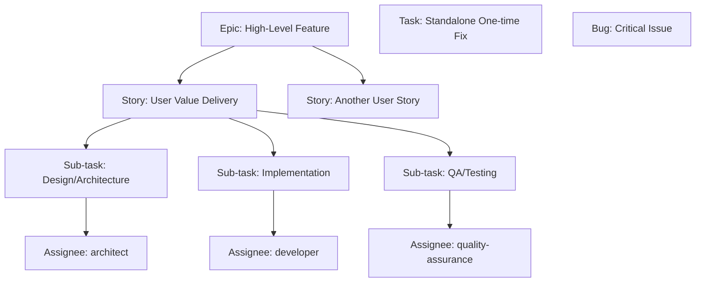
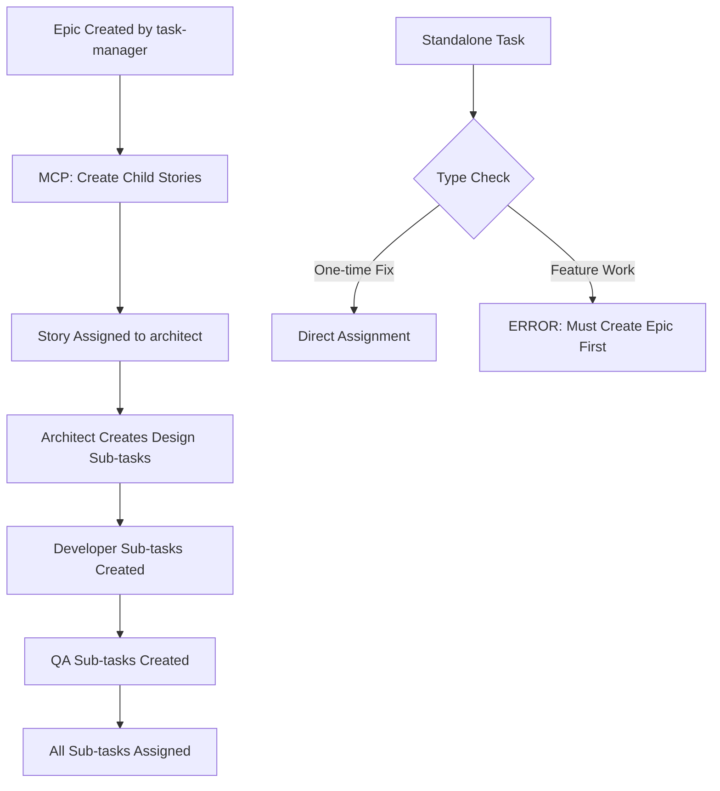
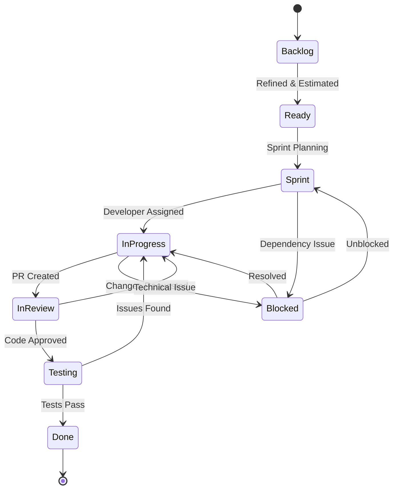
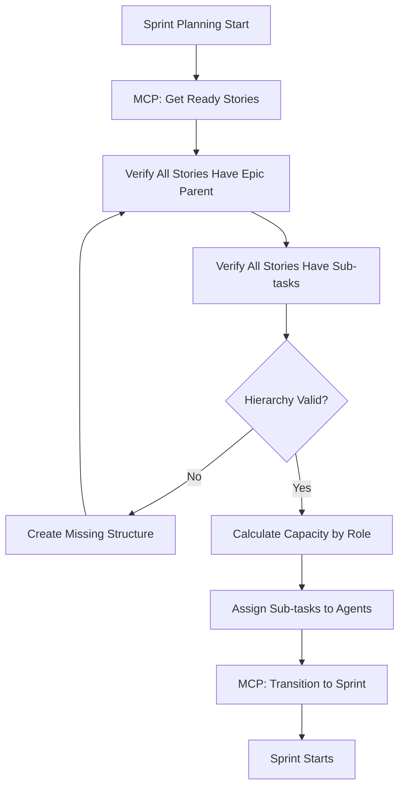
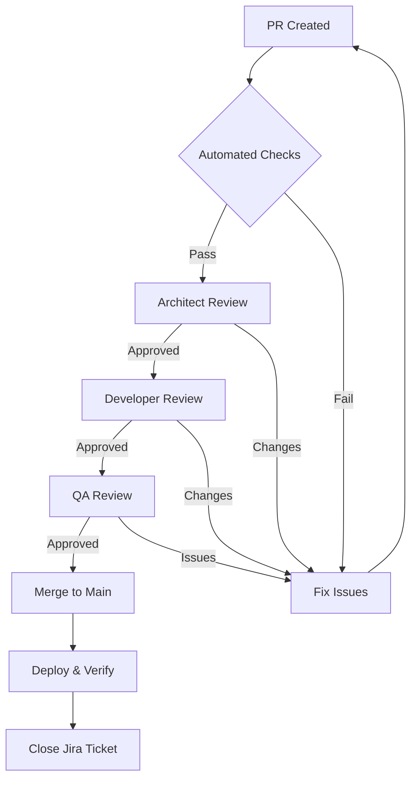

# Jira Task Management Integration for CLAUDE.md

## Jira Task Management System with MCP Server Integration

### Overview

LocalRetrieve implements a comprehensive Jira-based task management system leveraging Atlassian's Remote MCP Server for AI-assisted project management. This system enforces atomic task decomposition, role-based assignments, and complete traceability between code changes and business requirements through natural language commands and automated workflows.

### Mandatory Epic/Story/Task Hierarchy

#### Enforced Hierarchy Structure



**MANDATORY WORKFLOW RULES**:
- **Epics** are REQUIRED for all major features (general high-level tasks)
- **Stories** MUST be children of Epics (user-facing value delivery)
- **Sub-tasks** MUST be children of Stories (atomic work units)
- **Tasks** can be standalone ONLY for one-time fixes or operations
- **Bugs** can be standalone for critical issues

#### Mandatory Issue Type Definitions with MCP Automation

**Epic** (Type: Epic) - **REQUIRED FOR ALL FEATURES**
- **Purpose**: High-level task/feature spanning multiple sprints
- **Naming**: `[EPIC] Feature Name`
- **Example**: `[EPIC] Multi-Collection Vector Search`
- **Duration**: 2-6 sprints
- **Owner**: task-manager (Task Management Agent)
- **MCP Creation**: `mcp__atlassian__createJiraIssue` with issueTypeName="Epic"
- **Required Fields**:
  - Business justification
  - Success metrics
  - Risk assessment
  - Dependencies
  - agent_role: "task-manager"
  - Labels: ["management", "planning", "coordination"]

**Story** (Type: Story) - **MUST BE CHILD OF EPIC**
- **Purpose**: User-facing functionality that delivers value
- **Naming**: `As a <role> I want <capability> so that <outcome>`
- **Example**: `As a developer I want multiple vector collections so that I can organize different data types`
- **Duration**: 1-3 sprints
- **Parent**: MUST have Epic parent
- **MCP Creation**: `mcp__atlassian__createJiraIssue` with parent Epic ID
- **Story Points**: 3-13 (split if larger)
- **Required Fields**:
  - parent: Epic ID (MANDATORY)
  - Acceptance criteria (BDD format)
  - Definition of Done
  - Initial assignment to architect for design

**Sub-task** (Type: Sub-task) - **MUST BE CHILD OF STORY**
- **Purpose**: Atomic unit of work for single agent
- **Naming**: Specific technical action by role
- **Examples**:
  - `[Design] Define collection API interfaces`
  - `[Dev] Implement RPC handlers`
  - `[QA] Write E2E test suite`
- **Duration**: 2-8 hours
- **Parent**: MUST have Story parent
- **MCP Creation**: `mcp__atlassian__createJiraIssue` with parent Story ID
- **Required Agent Assignment**:
  - architect: Design and review sub-tasks
  - developer: Implementation sub-tasks
  - quality-assurance: Testing and validation sub-tasks
  - task-manager: Planning and coordination sub-tasks

**Task** (Type: Task) - **STANDALONE ONLY FOR ONE-TIME FIXES**
- **Purpose**: One-time fixes, operations, or maintenance
- **Naming**: `[Component] Action Description`
- **Example**: `[Hotfix] Fix memory leak in worker`
- **Duration**: 0.5-3 days
- **Use Cases**:
  - Emergency fixes
  - One-time operations
  - Maintenance tasks
  - Infrastructure updates
- **MCP Creation**: `mcp__atlassian__createJiraIssue` without parent

**Bug** (Type: Bug)
- **Purpose**: Defect requiring fix
- **Naming**: `[Component] Issue description`
- **Priority**: Critical/High/Medium/Low
- **Required Fields**:
  - Steps to reproduce
  - Expected vs actual behavior
  - Environment details
  - Regression test plan

### Mandatory Role-Based Assignment with MCP Enforcement

#### Agent Role Mapping with MCP Tools

```yaml
Task Management Agent:
  jira_role: task-manager
  mandatory_ownership:
    - Epic: ALWAYS owner
    - Story: Creates and assigns to architect
  mcp_operations:
    - mcp__atlassian__createJiraIssue: Create Epics/Stories
    - mcp__atlassian__searchJiraIssuesUsingJql: Sprint planning
    - mcp__atlassian__editJiraIssue: Backlog management
  responsibilities:
    - Epic creation and management
    - Story breakdown and prioritization
    - Sprint planning and capacity management
    - Progress tracking via dashboards
  labels: [management, planning, coordination]
  sub_task_assignments:
    - Backlog grooming sub-tasks
    - Sprint planning sub-tasks
    - Epic analysis sub-tasks

System Architect Agent:
  jira_role: architect
  mandatory_ownership:
    - Story: Design phase (from task-manager)
    - Sub-tasks: All design and review tasks
  mcp_operations:
    - mcp__atlassian__createJiraIssue: Create design sub-tasks
    - mcp__atlassian__editJiraIssue: Add technical specifications
    - mcp__atlassian__transitionJiraIssue: Approve designs
  responsibilities:
    - Story technical design
    - API specification
    - Architecture documentation
    - Design review and approval
  labels: [architecture, design, api, documentation]
  sub_task_types:
    - Design sub-tasks
    - Architecture review sub-tasks
    - Documentation sub-tasks

Coding Agent:
  jira_role: developer
  mandatory_ownership:
    - Sub-tasks: Implementation tasks ONLY
    - Standalone Tasks: One-time fixes
  mcp_operations:
    - mcp__atlassian__createJiraIssue: Create dev sub-tasks
    - mcp__atlassian__transitionJiraIssue: Update progress
    - mcp__atlassian__addCommentToJiraIssue: Add implementation notes
  responsibilities:
    - Implementation sub-tasks
    - Code development
    - Unit test creation
    - Bug fixes
  labels: [implementation, coding, development, bugfix]
  sub_task_types:
    - Development sub-tasks
    - Code review sub-tasks
    - Refactoring sub-tasks

QA Agent:
  jira_role: quality-assurance
  mandatory_ownership:
    - Sub-tasks: All QA and testing tasks
    - Bug: Can create and assign
  mcp_operations:
    - mcp__atlassian__createJiraIssue: Create QA sub-tasks/bugs
    - mcp__atlassian__transitionJiraIssue: Mark testing complete
    - mcp__atlassian__addCommentToJiraIssue: Add test results
  responsibilities:
    - Testing sub-tasks
    - E2E test implementation
    - Performance validation
    - Bug reporting and verification
  labels: [testing, qa, e2e, performance, regression]
  sub_task_types:
    - Testing sub-tasks
    - QA review sub-tasks
    - Performance validation sub-tasks
```

#### Assignment Rules

1. **Initial Assignment**: Task Management Agent creates and assigns stories
2. **Design Phase**: System Architect Agent receives story for technical design
3. **Implementation Phase**: Coding Agent receives tasks from approved design
4. **Validation Phase**: QA Agent receives completed implementation
5. **Review Cycle**: Returns to appropriate agent based on findings

### Mandatory Task Decomposition with MCP Automation

#### Enforced Decomposition Process



#### Mandatory Decomposition Rules with MCP Enforcement

**Epic → Stories (MANDATORY)**:
1. ALL feature work MUST start with an Epic
2. MCP Command: `Create epic for [feature] with Stories for [user capabilities]`
3. Each Story MUST be linked to parent Epic via `parent` field
4. Stories created via `mcp__atlassian__createJiraIssue` with Epic parent

**Story → Sub-tasks (MANDATORY)**:
1. Stories MUST be decomposed into Sub-tasks by role:
   - Design sub-tasks → architect
   - Implementation sub-tasks → developer
   - Testing sub-tasks → quality-assurance
   - Planning sub-tasks → task-manager
2. MCP Command: `Split story LR-123 into design, development, and QA sub-tasks`
3. Each sub-task MUST have single agent assignment
4. Sub-tasks created via `mcp__atlassian__createJiraIssue` with Story parent

**Standalone Tasks (EXCEPTION ONLY)**:
1. ONLY allowed for:
   - One-time fixes
   - Emergency hotfixes
   - Maintenance operations
   - Infrastructure updates
2. MUST NOT be used for feature development
3. Require justification in description

#### Mandatory Decomposition Example with MCP Commands

```
Epic: [EPIC] Multi-Collection Vector Search (Owner: task-manager)
├── Story: As a developer I want to create named collections (Parent: Epic)
│   ├── Sub-task: [architect] Design collection API interfaces
│   ├── Sub-task: [architect] Document API specifications
│   ├── Sub-task: [architect] Create architecture decision record
│   ├── Sub-task: [developer] Implement RPC handlers
│   ├── Sub-task: [developer] Update database schema
│   ├── Sub-task: [developer] Add validation logic
│   ├── Sub-task: [quality-assurance] Write unit test suite
│   ├── Sub-task: [quality-assurance] Create E2E scenarios
│   └── Sub-task: [quality-assurance] Performance validation
└── Story: As a developer I want to query specific collections (Parent: Epic)
    └── ... (similar sub-task breakdown by role)

Standalone Task: [HOTFIX] Fix worker memory leak (No parent - one-time fix)
└── Direct assignment to developer

MCP Commands for Creation:
1. "Create epic for Multi-Collection Vector Search"
2. "Create story under epic LR-100 for collection creation capability"
3. "Create design sub-task under story LR-101 for architect"
4. "Create development sub-tasks under story LR-101 for implementation"
5. "Create QA sub-tasks under story LR-101 for testing"
```

### Jira Field Standards

#### Required Custom Fields

```yaml
custom_fields:
  agent_role:
    type: select
    options: [task-manager, architect, developer, quality-assurance]
    required: true

  technical_component:
    type: multi-select
    options: [worker, database, rpc, wasm, api, ui, testing]
    required: true

  implementation_phase:
    type: select
    options: [planning, design, development, testing, review, done]
    required: true

  file_changes:
    type: text
    description: "List of files to be modified"
    required: for sub-tasks

  pr_link:
    type: url
    description: "GitHub PR URL"
    required: when status = "In Review"

  test_coverage:
    type: number
    description: "Percentage of code covered by tests"
    required: for development tasks
```

#### Label Standards

**Component Labels**:
- `component:worker` - Web Worker related
- `component:database` - SQLite/database layer
- `component:rpc` - RPC communication
- `component:wasm` - WASM compilation/loading
- `component:api` - Public API surface

**Phase Labels**:
- `phase:design` - Architecture/design phase
- `phase:implementation` - Active development
- `phase:testing` - QA/testing phase
- `phase:documentation` - Documentation updates

**Priority Labels**:
- `priority:critical` - Blocks release
- `priority:high` - Sprint commitment
- `priority:medium` - Should complete
- `priority:low` - Nice to have

**Technical Labels**:
- `tech:typescript` - TypeScript specific
- `tech:sqlite` - SQLite/SQL related
- `tech:vector` - Vector search specific
- `tech:performance` - Performance optimization

### Workflow Integration

#### Jira Workflow States



#### Status Definitions

- **Backlog**: Unrefined or not ready for development
- **Ready**: Refined, estimated, and ready for sprint
- **Sprint**: Committed to current sprint
- **In Progress**: Active development by assigned agent
- **Blocked**: Cannot proceed due to dependency/issue
- **In Review**: PR created, awaiting code review
- **Testing**: Code merged, QA validation in progress
- **Done**: All acceptance criteria met, deployed

#### Transition Rules

```yaml
transitions:
  to_ready:
    from: [Backlog]
    conditions:
      - Acceptance criteria defined
      - Story points estimated
      - Dependencies identified
      - Agent role assigned

  to_in_progress:
    from: [Sprint, Blocked]
    conditions:
      - Developer assigned
      - Dependencies resolved
      - Design approved (if applicable)

  to_in_review:
    from: [In Progress]
    conditions:
      - Code complete
      - Unit tests passing
      - PR created
      - Self-review completed

  to_testing:
    from: [In Review]
    conditions:
      - Code review approved
      - CI/CD checks passing
      - Merged to feature branch

  to_done:
    from: [Testing]
    conditions:
      - E2E tests passing
      - Documentation updated
      - Demo working
      - No critical issues
```

### Git Integration with MCP Automation

#### Branch Naming Convention with Hierarchy Validation

```
feature/[STORY-ID]-short-description  # For Story implementation
sub/[SUBTASK-ID]-specific-change      # For Sub-task work
hotfix/[TASK-ID]-critical-fix         # For standalone tasks only
```

Examples:
- `feature/LR-123-multi-collections` (Story branch)
- `sub/LR-124-design-api` (Sub-task branch)
- `hotfix/LR-789-memory-leak` (Standalone task)

**MCP Validation**: Branches are validated against Jira hierarchy via `mcp__atlassian__getJiraIssue`

#### Commit Message Format

```
[JIRA-ID] Component: Description

Detailed explanation of changes

- Implementation detail 1
- Implementation detail 2

Refs: #JIRA-ID
```

Example:
```
[LR-123] Worker: Add collection support to RPC handlers

Implemented new RPC message types for collection CRUD operations:
- Added CREATE_COLLECTION, DELETE_COLLECTION handlers
- Updated schema initialization for multi-collection support
- Added collection validation logic

Refs: #LR-123
```

#### Pull Request Integration

**PR Title Format**:
```
[JIRA-ID] Brief description of changes
```

**PR Description Template**:
```markdown
## Jira Ticket
[LR-123](https://localretrieve.atlassian.net/browse/LR-123)

## Summary
Brief description of what this PR accomplishes

## Changes
- [ ] Component 1: Description
- [ ] Component 2: Description
- [ ] Tests: Added/updated

## Agent Assignments
- Design Review: @architect-agent
- Code Review: @developer-agent
- QA Review: @qa-agent

## Testing
- [ ] Unit tests pass
- [ ] E2E tests pass
- [ ] Demo application tested
- [ ] Cross-browser verified

## Documentation
- [ ] API changes documented
- [ ] README updated if needed
- [ ] Inline comments added

## Definition of Done
- [ ] Code follows project standards
- [ ] Test coverage >80%
- [ ] No console errors/warnings
- [ ] Performance benchmarks pass
```

### Sprint Management with MCP Automation

#### Sprint Planning Process with Hierarchy Enforcement



**MCP Sprint Commands**:
- `"Plan Sprint 15 with Stories from Epic LR-100"`
- `"Assign sub-tasks to agents based on role"`
- `"Generate sprint commitment report"`

#### Sprint Metrics

**Velocity Tracking**:
```yaml
sprint_metrics:
  planned_points: 34
  completed_points: 31
  spillover_points: 3
  added_points: 5
  removed_points: 2

  by_agent:
    architect: 8
    developer: 15
    qa: 8

  by_component:
    worker: 12
    database: 10
    testing: 9
```

**Sprint Report Format**:
```markdown
# Sprint X Review

## Completed Items
- [LR-123] Multi-collection API design (5 SP)
- [LR-124] Collection CRUD implementation (8 SP)

## Spillover Items
- [LR-125] E2E test suite (3 SP) - 70% complete

## Impediments
- WASM compilation issues delayed LR-124
- Dependency on external library update

## Velocity Trend
Sprint X-2: 28 SP
Sprint X-1: 32 SP
Sprint X: 31 SP
Average: 30.3 SP

## Next Sprint Capacity
- Architect: 2 days (8 SP)
- Developer: 4 days (16 SP)
- QA: 3 days (12 SP)
Total: 36 SP available
```

### Progress Tracking

#### Daily Standup Format

```yaml
standup_report:
  date: 2025-01-24
  sprint_day: 5/10

  by_agent:
    architect:
      yesterday: "Completed collection API design"
      today: "Review PR #123, start performance analysis"
      blockers: "Need clarification on vector dimension limits"

    developer:
      yesterday: "Implemented RPC handlers"
      today: "Working on database schema updates"
      blockers: "None"

    qa:
      yesterday: "Created test scenarios"
      today: "Writing E2E tests"
      blockers: "Waiting for LR-124 completion"

  sprint_health:
    on_track_items: 5
    at_risk_items: 1
    blocked_items: 0
    burndown_status: "slightly behind"
```

#### Burndown Tracking

```
Sprint Burndown (Story Points)
Day 1:  ████████████████████ 40 SP
Day 2:  ███████████████████  38 SP
Day 3:  █████████████████    34 SP
Day 4:  ███████████████      30 SP
Day 5:  ██████████████       28 SP (current)
Day 6:  ████████████         24 SP (projected)
Day 7:  ██████████           20 SP
Day 8:  ███████              14 SP
Day 9:  ████                 8 SP
Day 10: ██                   4 SP
Target: 0 SP
```

### Quality Assurance Integration

#### Definition of Ready (DoR)

```yaml
definition_of_ready:
  story_level:
    - Clear acceptance criteria in BDD format
    - Story points estimated by team
    - Dependencies identified and resolved/planned
    - Technical design reviewed by architect
    - Test scenarios defined
    - No open questions from team

  task_level:
    - Technical specification complete
    - Files to modify identified
    - Test approach defined
    - Time estimate provided
    - No blocking dependencies
```

#### Definition of Done (DoD)

```yaml
definition_of_done:
  code_complete:
    - Feature implemented per specification
    - Code follows TypeScript strict mode
    - JSDoc comments for public methods
    - No console.error or console.warn

  testing_complete:
    - Unit tests written and passing
    - E2E tests updated if needed
    - Cross-browser testing done
    - Performance benchmarks pass

  review_complete:
    - Code review approved
    - Architect review (if needed)
    - QA validation passed

  documentation_complete:
    - API documentation updated
    - README updated if needed
    - Changelog entry added
    - Jira ticket updated
```

### Automation Rules

#### Jira Automation Configuration

```yaml
automation_rules:
  pr_created:
    trigger: "PR created with [LR-XXX] in title"
    actions:
      - Transition issue to "In Review"
      - Add PR link to issue
      - Notify assigned reviewer

  pr_merged:
    trigger: "PR merged to main"
    actions:
      - Transition issue to "Testing"
      - Add merge commit SHA
      - Trigger E2E test suite

  build_failed:
    trigger: "CI/CD pipeline failure"
    actions:
      - Add comment with failure details
      - Transition to "In Progress"
      - Notify developer

  sprint_start:
    trigger: "Sprint started"
    actions:
      - Move "Ready" items to "Sprint"
      - Generate sprint report
      - Create daily standup tasks

  story_complete:
    trigger: "All sub-tasks Done"
    actions:
      - Transition story to "Testing"
      - Calculate actual vs estimated
      - Update epic progress
```

### Reporting and Metrics

#### Key Performance Indicators (KPIs)

```yaml
sprint_kpis:
  velocity:
    target: 30-35 SP per sprint
    measure: 3-sprint rolling average

  predictability:
    target: 85% of committed points completed
    measure: completed/committed ratio

  quality:
    target: <5% defect rate
    measure: bugs found post-release / stories delivered

  cycle_time:
    target: <3 days average
    measure: in_progress to done duration

  code_review_time:
    target: <4 hours average
    measure: pr_created to first_review

project_kpis:
  epic_completion:
    measure: epics completed / epics planned

  technical_debt:
    measure: debt items / total backlog
    target: <15%

  test_coverage:
    measure: lines covered / total lines
    target: >80%

  documentation_coverage:
    measure: documented APIs / total APIs
    target: 100%
```

#### Dashboard Configuration

```yaml
jira_dashboard:
  widgets:
    - type: sprint_burndown
      position: top_left

    - type: velocity_chart
      position: top_right
      timeframe: last_6_sprints

    - type: issue_statistics
      position: middle_left
      grouping: by_agent_role

    - type: cycle_time_report
      position: middle_right

    - type: backlog_health
      position: bottom_left
      metrics: [ready_stories, technical_debt, bugs]

    - type: epic_progress
      position: bottom_right
      show_percentage: true
```

### Integration with File System

#### File System Synchronization

```yaml
sync_configuration:
  jira_to_filesystem:
    - Create /tasks/[JIRA-ID]-name/ on story creation
    - Update progress.md on status change
    - Add PR links to breakdown.md
    - Mark COMPLETED.md when Done

  filesystem_to_jira:
    - Parse markdown for acceptance criteria
    - Extract technical notes from design.md
    - Update story description from requirements.md
    - Link test files from testing.md
```

#### Task Directory Mapping

```
/tasks/LR-123-multi-collections/
├── requirements.md     # → Jira Description field
├── design.md           # → Jira Technical Design field
├── breakdown.md        # → Jira Sub-tasks
├── progress.md         # → Jira Comments/Work Log
├── testing.md          # → Jira Test Coverage field
└── COMPLETED.md        # Created when status = Done
```

### SDLC Best Practices

#### Continuous Integration

```yaml
ci_pipeline:
  on_pr_creation:
    - Validate Jira ticket reference
    - Check branch naming convention
    - Run linting and formatting
    - Execute unit tests
    - Build WASM and SDK
    - Run E2E tests
    - Generate coverage report
    - Update Jira with results

  on_merge:
    - Full build and test suite
    - Deploy to demo environment
    - Update documentation
    - Transition Jira ticket
    - Notify team channel
```

#### Code Review Process



#### Risk Management

```yaml
risk_tracking:
  identification:
    - Technical complexity assessment
    - Dependency analysis
    - Resource availability check
    - Timeline feasibility review

  mitigation:
    high_risk:
      - Create spike tasks for investigation
      - Assign senior architect oversight
      - Daily progress checks
      - Contingency plan required

    medium_risk:
      - Additional review cycles
      - Extra test coverage
      - Documentation requirements

    low_risk:
      - Standard process
      - Regular sprint reviews
```

### Retrospective Integration

#### Sprint Retrospective Process

```yaml
retrospective_format:
  data_gathering:
    - Jira metrics analysis
    - Velocity trends
    - Cycle time analysis
    - Defect rates
    - Team feedback survey

  discussion_topics:
    - What went well
    - What could improve
    - Action items
    - Process adjustments

  action_items:
    - Create improvement tickets
    - Update team agreements
    - Adjust estimation guidelines
    - Refine DoD/DoR

  tracking:
    - Add retrospective notes to Jira
    - Create follow-up tasks
    - Review previous action items
    - Update team metrics
```

### Migration Path

#### Transition from Current to Jira

```yaml
migration_phases:
  phase_1_setup:
    duration: 1 sprint
    tasks:
      - Configure Jira project
      - Create custom fields
      - Set up workflows
      - Configure automation

  phase_2_backlog:
    duration: 1 sprint
    tasks:
      - Import existing tasks
      - Create epics from features
      - Break down into stories
      - Estimate and prioritize

  phase_3_pilot:
    duration: 2 sprints
    tasks:
      - Run parallel tracking
      - Train team on process
      - Refine workflows
      - Adjust configurations

  phase_4_cutover:
    duration: 1 sprint
    tasks:
      - Full transition to Jira
      - Deprecate old tracking
      - Document lessons learned
      - Establish new baseline
```

### Appendix: Jira Configuration Templates

#### Project Configuration

```json
{
  "project": {
    "key": "LR",
    "name": "LocalRetrieve",
    "type": "software",
    "template": "scrum",
    "issueTypes": ["Epic", "Story", "Task", "Sub-task", "Bug"],
    "permissions": "developer-focused",
    "notifications": "standard"
  }
}
```

#### Custom Field Configuration

```json
{
  "customFields": [
    {
      "name": "Agent Role",
      "type": "select",
      "required": true,
      "options": ["task-manager", "architect", "developer", "quality-assurance"]
    },
    {
      "name": "Technical Component",
      "type": "multiselect",
      "required": true,
      "options": ["worker", "database", "rpc", "wasm", "api", "ui", "testing"]
    },
    {
      "name": "Implementation Phase",
      "type": "select",
      "required": true,
      "options": ["planning", "design", "development", "testing", "review", "done"]
    }
  ]
}
```

---

This comprehensive Jira task management system provides complete integration between LocalRetrieve's agent-based development model and modern SDLC practices, ensuring atomic task decomposition, clear role assignments, and full traceability from requirements to deployment.