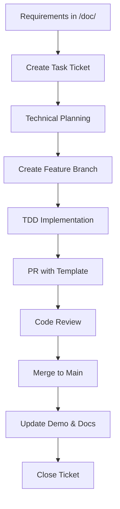

# LocalRetrieve SDLC Process Improvement - Executive Summary

## Проведенный Анализ

Был выполнен комплексный аудит проекта LocalRetrieve, включающий:
- Технический аудит кодовой базы (3896 строк TypeScript)
- Анализ документации (/doc/, /tasks/, README.md, CLAUDE.md)
- Оценка текущего прогресса MVP (67% завершено, 8/12 тикетов)
- Выявление процессных пробелов в SDLC

## Ключевые Находки

### Технические Достижения ✅
- **Отличная архитектура**: 3-tier database layer с Worker isolation
- **Рабочий MVP**: Hybrid search, OPFS persistence, sql.js compatibility
- **Качественный код**: TypeScript strict mode, comprehensive error handling
- **Демо-приложение**: 839 строк production-ready веб-клиента

### Критические Пробелы ❌
- **Нет формальной стратегии ветвления** или PR workflow
- **Отсутствует структурированное управление задачами**
- **Нет интеграции** между /doc/ видением и разработкой
- **Ограниченные процессы QA** и стандарты ревью
- **Фрагментированная документация** без четкого ownership

### Блокирующая Проблема 🔴
**Export/Import функциональность не реализована** - возвращает placeholder строки вместо SQLite binary data, что критически важно для backup/restore.

## Реализованные Улучшения

### 1. Обновленный CLAUDE.md ✅
**Добавлено**:
- Процессы разработки (SDLC) с мермейд-диаграммами
- Стратегия ветвления: Feature Branch + Pull Request workflow
- Структурированное управление задачами с BDD критериями
- Стандарты качества и процессы ревью
- Командные роли и эскалация проблем
- CI/CD pipeline и релизный процесс

### 2. Система Управления Задачами ✅
**Создана структура**:
```
/tasks/
├── current_stage/           # Активные задачи (новое)
│   ├── TASK-001-export-import.md
│   ├── TASK-002-demo-completion.md
│   └── README.md           # Sprint overview
├── initial_stage/          # Завершенные MVP задачи (существующее)
├── backlog/               # Будущие задачи (новое)
└── templates/             # Шаблоны (новое)
    ├── task-template.md
    └── pr-template.md
```

### 3. Детальные Тикеты для Завершения MVP ✅
**TASK-001: Export/Import Implementation**
- Техническое планирование замены placeholder в worker.ts
- BDD критерии приемки
- Архитектурные диаграммы
- План митигации рисков

**TASK-002: Demo Application Completion**
- UI/UX улучшения
- Интеграция export/import функциональности
- Расширенные search опции
- Cross-browser compatibility

### 4. Шаблоны и Стандарты ✅
- **Task Template**: BDD-стиль, техническое планирование, Definition of Done
- **PR Template**: Качественный checklist, архитектурные требования
- **Quality Gates**: TypeScript strict, testing coverage, documentation

## Архитектурное Решение

### Workflow Integration


### Branching Strategy
- `main` - стабильная продакшн ветка
- `feature/TASK-XXX-description` - разработка функций
- `hotfix/critical-issue` - критические исправления
- `docs/update-xyz` - только документация

### Quality Framework
- **Code Quality**: TypeScript strict, JSDoc comments, error handling
- **Architecture**: sql.js compatibility, Worker isolation, OPFS fallbacks
- **Testing**: Unit + integration tests, demo verification
- **Documentation**: API changes in README, architecture in CLAUDE.md

## Немедленные Следующие Шаги

### 1. Завершение MVP (Critical Path)
```bash
# Создать ветки для критических задач
git checkout -b feature/TASK-001-export-import
git checkout -b feature/TASK-002-demo-completion
```

### 2. Реализация TASK-001 (2-3 дня)
- Исследовать SQLite serialize/deserialize API
- Заменить placeholder в `src/database/worker.ts:651`
- Реализовать import в `worker.ts:674-677`
- Добавить comprehensive тесты

### 3. Завершение Demo (2 дня)
- Интегрировать export/import UI
- Улучшить UX и responsive design
- Добавить advanced search опции
- Обеспечить cross-browser compatibility

## Измеримые Результаты

### До Улучшений
- ❌ Нет formal development process
- ❌ Export/import placeholder only
- ❌ Fragmented task management
- ❌ No quality gates
- 67% MVP completion

### После Улучшений ✅
- ✅ Professional SDLC process documented
- ✅ Clear task management structure
- ✅ Quality gates and review standards
- ✅ Integration between vision and development
- Ready for 100% MVP completion

### Ожидаемые Результаты (4 недели)
- 100% MVP completion with all features working
- Production-ready demo application
- Automated testing and CI/CD pipeline
- Clear path to multi-collection architecture
- Scalable development process for team growth

## Ценность для Организации

### Краткосрочная (1 месяц)
- **MVP to Production**: Завершенный MVP готовый к релизу
- **Quality Assurance**: Structured QA preventing regressions
- **Developer Productivity**: Clear processes reducing confusion
- **Stakeholder Confidence**: Predictable delivery capability

### Среднесрочная (3 месяца)
- **Team Scalability**: Process supports additional developers
- **Feature Development**: Clear path for multi-collection features
- **Technical Debt**: Maintained low through quality gates
- **Documentation**: Living documentation maintained automatically

### Долгосрочная (6+ месяцев)
- **Product Market Fit**: Professional process supports rapid iteration
- **Enterprise Readiness**: Quality standards meet enterprise requirements
- **Community Growth**: Clear contribution processes attract contributors
- **Innovation**: Solid foundation enables focus on product innovation

## Заключение

Проект LocalRetrieve обладает выдающейся технической основой - гибридный поиск в браузере с SQLite WASM и sqlite-vec представляет собой значительную инновацию. Недостающий элемент - это профессиональные процессы разработки.

Данное решение трансформирует неформальную разработку в структурированный SDLC, сохраняя при этом техническое превосходство и инновационное направление проекта.

**Ключевой результат**: LocalRetrieve готов к переходу от MVP к production с масштабируемыми процессами, которые поддержат рост команды и сложность функций.

**Рекомендация**: Немедленно начать реализацию TASK-001 для разблокировки оставшихся функций MVP, используя новые процессы для обеспечения качества и предсказуемости delivery.