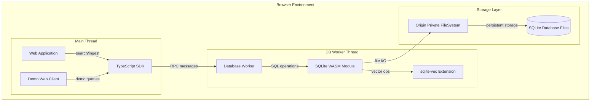

# LocalRetrieve MVP Description

## Problem Statement & Assumptions

**Goal**: Deliver a minimal viable browser-native retrieval engine that demonstrates hybrid search (FTS5 + sqlite-vec) with sql.js compatibility, running entirely in-browser with durable OPFS storage.

**Success Metrics**: 
- Time-to-first-search < 10 minutes for new developers
- Hybrid query latency p95 < 500ms on 10k document corpus
- Portable WASM bundle < 6MB

**Constraints**:
- Browser-only (Chrome/Firefox desktop, basic Safari support)
- Single collection, single vector field for MVP
- No encryption, no multi-tab coordination
- Local-only (no remote providers)
- COOP/COEP headers required for optimal performance

**Key Assumptions**:
- Developers familiar with sql.js API patterns
- Target corpus: 1k-10k documents, <1GB total
- Primary use case: documentation/knowledge base search
- WebAssembly and OPFS support available in target browsers

## Target Behavior & Acceptance

**MVP must deliver**:
- [ ] Single WASM package with SQLite (FTS5, JSON1, RTREE, math) + sqlite-vec
- [ ] sql.js-compatible TypeScript wrapper with familiar API surface
- [ ] OPFS-backed durable storage with file persistence across sessions
- [ ] Hybrid search combining FTS5 (BM25) and sqlite-vec (ANN) with basic fusion
- [ ] Web Worker implementation for non-blocking operations
- [ ] Complete build pipeline from source to distributable assets
- [ ] Working web client demo with ingest, search, and export functionality
- [ ] Installation instructions and usage examples

**Acceptance Criteria**:
- **Given** a developer wants to add hybrid search to their web app
- **When** they follow the installation guide
- **Then** they can ingest documents and perform hybrid queries within 10 minutes

- **Given** 1000 documents are indexed with both text and vector data
- **When** a hybrid search query is executed
- **Then** results combine FTS and vector scoring with p95 latency < 500ms

- **Given** documents are stored in OPFS
- **When** the browser is refreshed or closed
- **Then** data persists and can be queried immediately upon reopening

## Architecture Overview



**Core Components**:
1. **SQLite WASM Core**: Official SQLite build with OPFS VFS + compiled sqlite-vec
2. **Database Worker**: Web Worker handling all database operations with RPC interface
3. **TypeScript SDK**: sql.js-compatible wrapper with hybrid search orchestration
4. **Demo Client**: Simple web interface for testing and demonstration

**Data Flow**:
1. Documents ingested via SDK → chunked and embedded (stub embedder for MVP)
2. Text stored in collection-scoped FTS5 table, vectors in collection-scoped vec0 table
3. Hybrid queries use future-compatible SearchRequest interface with single collection
4. Results returned as SearchResponse with extensible scoring structure

## Technology & Decisions

**Core Stack**:
- **SQLite WASM**: Official ext/wasm build with OPFS VFS for durable storage
- **sqlite-vec**: Compiled as built-in extension via sqlite_wasm_extra_init.c
- **TypeScript**: Strict typing with sql.js-compatible interface
- **Web Workers**: Isolate database operations from main thread
- **Vite**: Development server with COOP/COEP headers for SharedArrayBuffer support

**Key Technical Decisions**:

| Decision | Rationale | Trade-off |
|----------|-----------|-----------|
| OPFS VFS over in-memory | Durable storage requirement | Requires COOP/COEP headers |
| sql.js compatibility | Familiar API for adoption | Some limitations vs native SQLite API |
| Single collection MVP | Reduces complexity | Multi-tenant features deferred |

**Architecture Decision Records**:
- **ADR-001: SQLite WASM + OPFS**: Use official SQLite WASM with OPFS VFS for maximum compatibility and durable storage
- **ADR-002: Embedded sqlite-vec**: Compile sqlite-vec as built-in extension to avoid runtime loading complexity

## Repository Structure Proposal

```
browvec/
├── doc/                          # Documentation
│   ├── architecture/             # Architecture diagrams and ADRs
│   ├── api/                      # API documentation and contracts
│   └── guides/                   # Installation and usage guides
├── src/                          # Source code
│   ├── core/                     # Core engine
│   │   ├── wasm/                 # WASM build artifacts
│   │   ├── workers/              # Worker implementations
│   │   │   ├── db-worker/        # Database worker (MVP: single)
│   │   │   ├── embedder-worker/  # Embedder worker (future)
│   │   │   └── reranker-worker/  # Reranker worker (future)
│   │   └── sdk/                  # TypeScript SDK
│   │       ├── database/         # Database abstraction
│   │       ├── providers/        # Provider interfaces (extensible)
│   │       ├── collections/      # Collection management
│   │       └── search/           # Search orchestration
│   ├── examples/                 # Example applications
│   │   └── web-client/           # Demo web client
│   └── types/                    # TypeScript type definitions
├── scripts/                      # Build and utility scripts
├── tests/                        # Test suites
├── dist/                         # Built distributable files
├── CHANGELOG.md
├── README.md
└── package.json
```

## Interfaces & Contracts

**Core Database Worker RPC** (Future-compatible):
```typescript
interface DBWorkerAPI {
  // Low-level SQL operations (sql.js compatibility)
  open(filename: string): Promise<void>
  exec(sql: string, params?: SQLValue[]): Promise<void>
  select(sql: string, params?: SQLValue[]): Promise<Row[]>
  export(): Promise<Uint8Array>
  close(): Promise<void>
  
  // High-level search operations (extensible)
  search(request: SearchRequest): Promise<SearchResponse>
  
  // Collection management (MVP: single collection)
  createCollection(name: string, schema: CollectionSchema): Promise<void>
  listCollections(): Promise<CollectionInfo[]>
}
```

**SDK Public Interface** (Target-compatible subset):
```typescript
// sql.js compatibility layer
class Database {
  static create(filename?: string): Promise<Database>
  exec(sql: string): this
  run(sql: string, params?: SQLValue[]): this
  prepare(sql: string): Statement
  export(): Uint8Array
  close(): void
}

// Future-compatible search interface (MVP subset)
interface SearchRequest {
  collection: string // MVP: single collection only
  query?: {
    text?: string
    vector?: Float32Array // MVP: manual vectors only
  }
  limit?: number
  // Future: filters, fusion, rerank, groupBy, etc.
}

interface SearchResponse {
  results: SearchResult[]
  // Future: debug, timing, fusion stats
}

interface SearchResult {
  id: string | number
  rowid: number
  score: number
  scores: {
    fts?: number
    vec?: number
    // Future: rerank, per-vector scores
  }
  title?: string
  snippet?: string
  // Future: anchors, payload, metadata
}

// Provider interfaces (MVP: stub implementations)
interface EmbedderProvider {
  embed(texts: string[]): Promise<Float32Array[]>
  info(): { name: string; dim: number; device: string }
}

interface RerankerProvider {
  rerank(query: string, documents: string[]): Promise<number[]>
  info(): { name: string; model: string }
}
```

**Data Schema** (Multi-collection ready):
```sql
-- Collections registry (future-compatible)
CREATE TABLE IF NOT EXISTS collections (
  name TEXT PRIMARY KEY,
  created_at INTEGER,
  schema_version INTEGER,
  config JSON
);

-- Collection vectors registry (future-compatible)
CREATE TABLE IF NOT EXISTS collection_vectors (
  collection TEXT,
  vector_name TEXT,
  dim INTEGER,
  metric TEXT, -- 'cosine', 'l2', 'dot'
  type TEXT,   -- 'float32', 'int8', 'binary'
  UNIQUE(collection, vector_name)
);

-- MVP: Single collection tables (pattern for future collections)
-- docs_default - Base documents table
CREATE TABLE IF NOT EXISTS docs_default (
  rowid INTEGER PRIMARY KEY,
  id TEXT,
  title TEXT,
  content TEXT,
  created_at INTEGER,
  metadata JSON
);

-- fts_default - FTS5 virtual table
CREATE VIRTUAL TABLE IF NOT EXISTS fts_default USING fts5(
  id UNINDEXED,
  title,
  content,
  tokenize = "unicode61 remove_diacritics 2"
);

-- vec_default_dense - Vector table (pattern: vec_{collection}_{vector_name})
CREATE VIRTUAL TABLE IF NOT EXISTS vec_default_dense USING vec0(
  rowid INTEGER PRIMARY KEY,
  embedding float[384]
);
```

## Security & Compliance

**MVP Security Posture**:
- No encryption at rest (deferred to Phase 2)
- WASM memory isolation via browser sandbox
- No remote network calls (local-only operation)
- CSP recommendations for host applications
- Secure defaults for OPFS file permissions

**Data Boundaries**:
- All data remains in origin-scoped OPFS
- No telemetry or external communication
- Export functionality provides user data portability

## Operations

**Deployment Target**: Static web hosting with COOP/COEP headers
**Configuration**: Environment-based build flags for debug/release
**Observability**: Console logging with configurable levels
**Rollback**: Version-tagged releases with semantic versioning

**Required HTTP Headers**:
```
Cross-Origin-Opener-Policy: same-origin
Cross-Origin-Embedder-Policy: require-corp
```

**Performance Tuning**:
- SQLite PRAGMAs: `synchronous=NORMAL`, `cache_size=-64000`, `temp_store=MEMORY`
- WASM build flags: `-O2` for speed, `ALLOW_MEMORY_GROWTH=1`
- Worker-based architecture prevents main thread blocking

## Milestones & Phased Plan

### Phase 1: Core Engine (Weeks 1-2)
**Goal**: Working WASM build with hybrid search
- Build SQLite WASM + sqlite-vec from source
- Create Database Worker with RPC interface  
- Implement basic sql.js compatibility wrapper
- **Success**: Can create tables, insert data, perform hybrid queries

### Phase 2: SDK & Integration (Weeks 3-4)
**Goal**: Developer-friendly SDK with TypeScript support
- Complete TypeScript SDK with full sql.js compatibility
- Add hybrid search convenience methods
- Create comprehensive type definitions
- **Success**: SDK can ingest documents and return ranked results

### Phase 3: Demo & Documentation (Weeks 5-6)
**Goal**: Complete developer experience
- Build demo web client with ingest/search UI
- Write installation and usage documentation
- Create example applications and tutorials
- **Success**: New developer can follow guide and have working search in 10 minutes

## Work Breakdown (Developer-Ready Tickets)

*(Detailed tickets will be provided in separate work breakdown document)*

### Infrastructure Tickets (6 tickets)
- Setup build pipeline with Emscripten
- Configure WASM compilation with sqlite-vec
- Create Database Worker foundation
- Setup TypeScript build pipeline
- Configure development server with headers
- Create testing infrastructure

### Core Functionality Tickets (8 tickets)  
- Implement sql.js compatibility layer
- Add OPFS integration and persistence
- Create hybrid search orchestration
- Implement basic result fusion
- Add export/import functionality
- Create error handling and logging
- Implement basic performance monitoring
- Add TypeScript type definitions

### Demo & Documentation Tickets (4 tickets)
- Build demo web client interface
- Create installation documentation
- Write usage examples and tutorials
- Add API reference documentation

## Risks & Mitigations

**Top 3 Risks**:

1. **WASM Build Complexity**
   - *Risk*: Emscripten + SQLite + sqlite-vec build chain issues
   - *Mitigation*: Use official SQLite WASM build process; containerized build environment

2. **Browser Compatibility**
   - *Risk*: OPFS/SharedArrayBuffer support variations across browsers
   - *Mitigation*: Graceful fallbacks; clear browser support matrix

3. **Performance Targets**
   - *Risk*: Hybrid search latency exceeds 500ms on target corpus size
   - *Mitigation*: Performance benchmarking in CI; SQL query optimization

## Forward Compatibility Design

**Collection Extensibility**:
- MVP implements single "default" collection using target naming pattern
- Collection registry tables present but only populated with default entry
- Future collections follow same `docs_{name}`, `fts_{name}`, `vec_{name}_{vector}` pattern

**Provider Extensibility**:
- Provider interfaces defined with stub implementations for MVP
- MVP uses manual vector input; embedder provider returns identity transformation
- Provider registry reserved in config for future local/remote implementations

**Search Pipeline Extensibility**:
- SearchRequest/SearchResponse types defined with MVP subset
- Future fusion modes, filters, reranking can be added without interface changes
- Worker search() method supports full target interface with MVP subset implementation

**Architecture Extensibility**:
- Worker structure ready for Embedder/Reranker workers (stubbed in MVP)
- SDK modules organized by responsibility (database, providers, collections, search)
- Registry tables support multi-collection metadata without core schema changes

**Migration Path**:
- Version-aware schema with `PRAGMA user_version`
- SDK migration helpers for adding collections, vectors, providers
- Backward-compatible API surface - existing code continues working

## Open Questions

- Should MVP include identity embedder provider or require manual vectors?
- What minimum browser versions should we target for OPFS support?
- Should we implement basic collection management UI in demo client?
- How detailed should provider configuration be in registry tables?