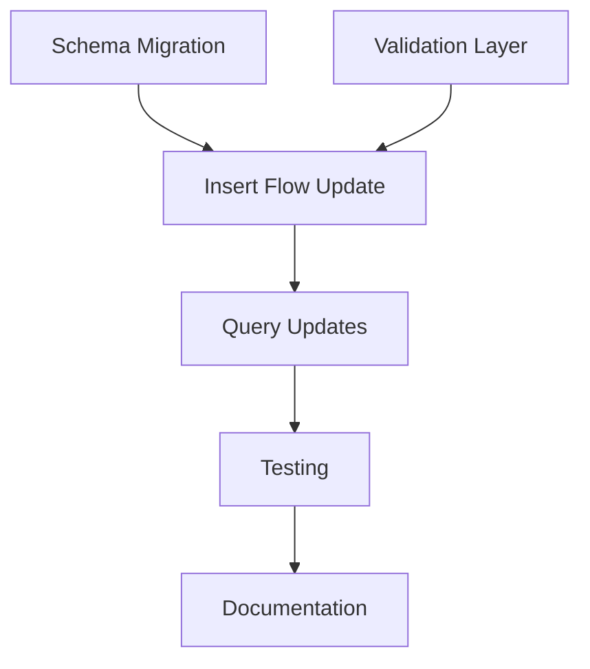

# TASK-001: Work Breakdown

## Task Structure

```
TASK-001-document-insert-fixes/
├── 1-schema-migration/
├── 2-validation-layer/
├── 3-insert-flow-update/
├── 4-query-updates/
├── 5-testing/
└── 6-documentation/
```

## 1. Schema Migration (0.5 day)

### 1.1 Update Schema Version
- **File**: `src/database/worker/schema/SchemaManager.ts`
- **Changes**:
  - Update `CURRENT_SCHEMA_VERSION = 3`
  - Add migration path from v2 to v3

### 1.2 Implement Migration Function
- **File**: `src/database/worker/schema/SchemaManager.ts`
- **Function**: `migrateFromV2ToV3()`
- **Steps**:
  1. Add `collection` column to `docs_default`
  2. Extract collection from metadata and populate new column
  3. Remove collection field from metadata JSON
  4. Create index on collection column
  5. Update schema_version in collections table

### 1.3 Update Schema Creation
- **File**: `src/database/worker/schema/SchemaManager.ts`
- **Function**: `createSchema()`
- **Changes**:
  - Add `collection TEXT NOT NULL` to docs_default table
  - Add `CREATE INDEX idx_docs_collection ON docs_default(collection)`

## 2. Validation Layer (0.5 day)

### 2.1 Create Custom Error Classes
- **File**: `src/database/worker/utils/Errors.ts` (new file)
- **Classes**:
  ```typescript
  export class ValidationError extends Error
  export class DocumentInsertError extends Error
  ```

### 2.2 Implement Validation Function
- **File**: `src/database/worker/utils/Validation.ts` (new file)
- **Function**: `validateDocument(document, collection)`
- **Checks**:
  - Required fields (content OR title)
  - Metadata structure (plain object)
  - Reserved field warning (metadata.collection)
  - ID type validation

### 2.3 Add Type Guards
- **File**: `src/database/worker/utils/TypeGuards.ts`
- **Updates**:
  - Import and use validation function
  - Update `isInsertDocumentWithEmbeddingParams`

## 3. Insert Flow Update (0.5 day)

### 3.1 Update handleInsertDocumentWithEmbedding
- **File**: `src/database/worker/core/DatabaseWorker.ts`
- **Function**: `handleInsertDocumentWithEmbedding()`
- **Changes** (line 416-441):
  1. Add validation call
  2. Remove metadata injection (line 431)
  3. Update INSERT query to include collection column
  4. Add post-insert verification
  5. Improve error handling

**Current Code** (line 416-441):
```typescript
private async handleInsertDocumentWithEmbedding(params: InsertDocumentWithEmbeddingParams): Promise<{ id: string; embeddingGenerated: boolean }> {
  const validParams = this.validateParams(params, isInsertDocumentWithEmbeddingParams, 'handleInsertDocumentWithEmbedding');
  this.ensureInitialized();

  return this.withContext('insertDocumentWithEmbedding', async () => {
    const documentId = validParams.document.id || `doc_${Date.now()}`;

    const sql = `
      INSERT OR REPLACE INTO docs_default (id, title, content, metadata, created_at, updated_at)
      VALUES (?, ?, ?, ?, strftime('%s', 'now'), strftime('%s', 'now'))
    `;

    const metadata = { ...validParams.document.metadata, collection: validParams.collection }; // ❌ REMOVE THIS
    await this.sqliteManager.select(sql, [
      documentId,
      validParams.document.title || '',
      validParams.document.content,
      JSON.stringify(metadata)
    ]);

    return { id: documentId, embeddingGenerated: false };
  });
}
```

**New Code**:
```typescript
private async handleInsertDocumentWithEmbedding(params: InsertDocumentWithEmbeddingParams): Promise<{ id: string; embeddingGenerated: boolean }> {
  const validParams = this.validateParams(params, isInsertDocumentWithEmbeddingParams, 'handleInsertDocumentWithEmbedding');
  this.ensureInitialized();

  return this.withContext('insertDocumentWithEmbedding', async () => {
    // STEP 1: Validate document
    validateDocument(validParams.document, validParams.collection);

    // STEP 2: Generate ID
    const documentId = validParams.document.id?.toString() ||
      `doc_${Date.now()}_${Math.random().toString(36).substr(2, 9)}`;

    // STEP 3: Prepare user metadata (NO INJECTION)
    const userMetadata = validParams.document.metadata || {};

    // STEP 4: Insert with collection column
    const sql = `
      INSERT OR REPLACE INTO docs_default (id, title, content, collection, metadata, created_at, updated_at)
      VALUES (?, ?, ?, ?, ?, strftime('%s', 'now'), strftime('%s', 'now'))
    `;

    try {
      await this.sqliteManager.exec(sql, [
        documentId,
        validParams.document.title || '',
        validParams.document.content,
        validParams.collection,           // ✅ Separate column
        JSON.stringify(userMetadata)       // ✅ Pure user data
      ]);
    } catch (error) {
      throw new DocumentInsertError(
        `Failed to insert document into collection '${validParams.collection}'`,
        {
          collection: validParams.collection,
          documentId,
          providedFields: Object.keys(validParams.document),
          originalError: error instanceof Error ? error : undefined,
          suggestion: 'Check that document structure matches schema and ID is unique'
        }
      );
    }

    // STEP 5: Verify insertion
    const verifyResult = await this.sqliteManager.select(
      'SELECT COUNT(*) as count FROM docs_default WHERE id = ? AND collection = ?',
      [documentId, validParams.collection]
    );

    const insertedCount = verifyResult.rows[0]?.count || 0;
    if (insertedCount === 0) {
      throw new DocumentInsertError(
        `Document insertion verification failed: id='${documentId}' was not found in database`,
        {
          collection: validParams.collection,
          documentId,
          providedFields: Object.keys(validParams.document),
          suggestion:
            'This may be caused by:\n' +
            '  1) Unique constraint violation (duplicate ID)\n' +
            '  2) Database connection issue\n' +
            '  3) Transaction rollback'
        }
      );
    }

    return { id: documentId, embeddingGenerated: false };
  });
}
```

## 4. Query Updates (0.25 day)

### 4.1 Update SchemaManager.getCollectionInfo
- **File**: `src/database/worker/schema/SchemaManager.ts`
- **Function**: `getCollectionInfo()` (line 282-300)
- **Change**: Line 297
  ```typescript
  // OLD:
  WHERE json_extract(metadata, '$.collection') = ?

  // NEW:
  WHERE collection = ?
  ```

### 4.2 Update Search Queries
- **File**: `src/database/worker/handlers/SearchHandler.ts`
- **Changes**: Find all instances of `json_extract(metadata, '$.collection')` and replace with `collection`

### 4.3 Update Embedding Queue Queries
- **File**: `src/database/worker/embedding/EmbeddingQueue.ts`
- **Changes**: Update any queries using json_extract for collection filtering

## 5. Testing (0.5 day)

### 5.1 Unit Tests - Validation
- **File**: `tests/unit/validation.test.ts` (new file)
- **Tests**:
  - Valid document acceptance
  - Required fields validation
  - Metadata type validation
  - Reserved field warning
  - ID type validation

### 5.2 Unit Tests - Error Classes
- **File**: `tests/unit/errors.test.ts` (new file)
- **Tests**:
  - ValidationError context
  - DocumentInsertError context
  - Error message formatting

### 5.3 Integration Tests - Insert Flow
- **File**: `tests/integration/insert-document.test.ts` (new file)
- **Tests**:
  - Successful insert and verify
  - Metadata preservation
  - Custom ID support
  - Insert failure detection
  - Validation errors
  - Post-insert verification

### 5.4 Integration Tests - Migration
- **File**: `tests/integration/schema-migration.test.ts` (new file)
- **Tests**:
  - Migration from v2 to v3
  - Data preservation
  - Index creation
  - Backwards compatibility

### 5.5 E2E Tests
- **File**: `tests/e2e/document-operations.spec.ts`
- **Tests**:
  - Full workflow with demo app
  - Metadata round-trip
  - Error handling UI

## 6. Documentation (0.5 day)

### 6.1 Update README - Custom IDs
- **File**: `README.md`
- **Section**: Add after line 299
- **Content**:
  - Custom ID support explanation
  - Constraints and recommendations
  - Examples with and without custom IDs

### 6.2 Update README - Metadata API Contract
- **File**: `README.md`
- **Section**: Add after line 641
- **Content**:
  - Metadata preservation guarantees
  - No reserved fields statement
  - Type preservation details
  - Limitations (JSON constraints)
  - Round-trip test example

### 6.3 Create Migration Guide
- **File**: `docs/migration-v2-to-v3.md` (new file)
- **Content**:
  - Breaking changes overview
  - Code migration examples
  - Before/after comparisons
  - Automated migration steps

### 6.4 Update Examples
- **File**: `examples/web-client/demo.js`
- **Changes**:
  - Update to use metadata properly
  - Show custom ID usage
  - Demonstrate metadata preservation

## Dependencies Between Tasks



## Estimated Timeline

| Task | Estimated Time | Priority |
|------|----------------|----------|
| 1. Schema Migration | 0.5 day | Critical |
| 2. Validation Layer | 0.5 day | Critical |
| 3. Insert Flow Update | 0.5 day | Critical |
| 4. Query Updates | 0.25 day | High |
| 5. Testing | 0.5 day | High |
| 6. Documentation | 0.5 day | Medium |
| **TOTAL** | **2.75 days** | |

## Files to Create

1. `src/database/worker/utils/Errors.ts` - Custom error classes
2. `src/database/worker/utils/Validation.ts` - Validation functions
3. `tests/unit/validation.test.ts` - Validation tests
4. `tests/unit/errors.test.ts` - Error class tests
5. `tests/integration/insert-document.test.ts` - Insert flow tests
6. `tests/integration/schema-migration.test.ts` - Migration tests
7. `docs/migration-v2-to-v3.md` - Migration guide

## Files to Modify

1. `src/database/worker/schema/SchemaManager.ts` - Schema migration
2. `src/database/worker/core/DatabaseWorker.ts` - Insert flow
3. `src/database/worker/utils/TypeGuards.ts` - Add validation
4. `src/database/worker/handlers/SearchHandler.ts` - Query updates
5. `src/database/worker/embedding/EmbeddingQueue.ts` - Query updates
6. `README.md` - Documentation updates
7. `examples/web-client/demo.js` - Example updates
8. `tests/e2e/document-operations.spec.ts` - E2E tests

## Implementation Order

1. **Day 1 Morning**: Schema Migration (1.1, 1.2, 1.3)
2. **Day 1 Afternoon**: Validation Layer (2.1, 2.2, 2.3)
3. **Day 2 Morning**: Insert Flow Update (3.1)
4. **Day 2 Afternoon**: Query Updates (4.1, 4.2, 4.3) + Start Testing (5.1, 5.2)
5. **Day 3 Morning**: Finish Testing (5.3, 5.4, 5.5)
6. **Day 3 Afternoon**: Documentation (6.1, 6.2, 6.3, 6.4)

## Success Criteria

✅ All tests pass (unit + integration + E2E)
✅ Migration from v2 to v3 works with real data
✅ Metadata round-trip test passes
✅ No silent failures (all errors thrown)
✅ Documentation complete and clear
✅ Demo app works with new code
✅ Breaking changes documented in migration guide
