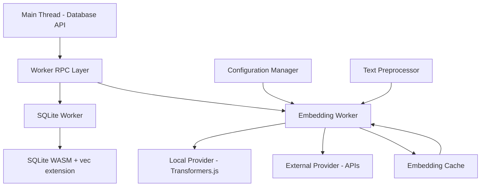

# TASK-004: Embedding Generation Support - Technical Design

## Architecture Overview

### High-Level Design Principles

1. **Collection-Level Configuration**: Embedding dimensions and providers defined per collection, not globally
2. **Non-Blocking Architecture**: All embedding generation happens in Web Workers to maintain UI responsiveness
3. **Provider Abstraction**: Pluggable embedding providers with unified interface for local and external services
4. **Backward Compatibility**: Existing manual vector workflows continue unchanged
5. **Progressive Enhancement**: Zero-config defaults with advanced configuration options
6. **Caching Strategy**: Intelligent caching to minimize redundant embedding generation

### System Architecture



### Component Design

#### 1. Embedding Provider Interface

```typescript
interface EmbeddingProvider {
  readonly name: string;
  readonly dimensions: number; // Fixed per provider instance
  readonly maxBatchSize: number;

  initialize(config: EmbeddingConfig): Promise<void>;
  generateEmbedding(text: string): Promise<Float32Array>;
  generateBatch(texts: string[]): Promise<Float32Array[]>;
  cleanup(): Promise<void>;
}

interface CollectionEmbeddingConfig {
  provider: 'transformers' | 'openai' | 'cohere' | 'custom';
  model?: string;
  dimensions: number; // Required per collection
  apiKey?: string;
  batchSize?: number;
  cacheEnabled?: boolean;
  timeout?: number;
}

interface EmbeddingConfig {
  // Global fallback configuration
  defaultProvider: 'transformers' | 'openai' | 'cohere';
  defaultModel?: string;
  defaultDimensions: number;
  apiKey?: string;
  cacheStrategy?: 'memory' | 'indexeddb' | 'none';
}
```

#### 2. Embedding Manager (Worker-based)

```typescript
class EmbeddingManager {
  private provider: EmbeddingProvider;
  private cache: EmbeddingCache;
  private textProcessor: TextProcessor;

  async generateForDocument(text: string, docId: string): Promise<Float32Array>;
  async generateForQuery(query: string): Promise<Float32Array>;
  async generateBatch(documents: DocumentInput[]): Promise<EmbeddingResult[]>;

  private async preprocessText(text: string): Promise<string>;
  private async checkCache(textHash: string): Promise<Float32Array | null>;
  private async storeInCache(textHash: string, embedding: Float32Array): Promise<void>;
}
```

#### 3. Local Provider (Transformers.js)

```typescript
class TransformersProvider implements EmbeddingProvider {
  private model: any; // Transformers.js model
  private pipeline: any;

  readonly name = 'transformers';
  readonly dimensions: number; // Fixed per instance
  readonly maxBatchSize = 32;

  constructor(modelName: string = 'Xenova/all-MiniLM-L6-v2', dimensions: number = 384) {
    // Common models and their dimensions:
    // all-MiniLM-L6-v2: 384
    // all-mpnet-base-v2: 768
    // e5-large-v2: 1024
    this.dimensions = dimensions;
  }

  async initialize(config: EmbeddingConfig): Promise<void> {
    // Load all-MiniLM-L6-v2 or similar model
    // Initialize in Web Worker context
  }

  async generateEmbedding(text: string): Promise<Float32Array> {
    // Use Transformers.js pipeline for embedding generation
    // Return normalized 384-dimensional vector
  }
}
```

#### 4. External API Provider

```typescript
class OpenAIProvider implements EmbeddingProvider {
  private apiKey: string;
  private model: string;

  readonly name = 'openai';
  readonly dimensions: number; // Fixed per instance
  readonly maxBatchSize = 100;

  constructor(model: string = 'text-embedding-3-small', dimensions: number = 1536) {
    // Model dimensions (can be reduced for newer models):
    // text-embedding-3-small: 1536 default (reducible)
    // text-embedding-3-large: 3072 default (reducible)
    // text-embedding-ada-002: 1536 (fixed)
    this.model = model;
    this.dimensions = dimensions;
  }

  async generateEmbedding(text: string): Promise<Float32Array> {
    // HTTP request to OpenAI Embeddings API
    // Handle rate limiting and errors
    // Return normalized vector
  }
}
```

### Database Schema Extensions

#### Enhanced Document Storage

```sql
-- Collections table for embedding configuration
CREATE TABLE IF NOT EXISTS collections (
  id TEXT PRIMARY KEY,
  name TEXT NOT NULL,
  embedding_provider TEXT,
  embedding_model TEXT,
  embedding_dimensions INTEGER,
  vector_table_name TEXT,
  created_at DATETIME DEFAULT CURRENT_TIMESTAMP
);

-- Add collection reference to documents
ALTER TABLE docs_default ADD COLUMN collection_id TEXT DEFAULT 'default';
ALTER TABLE docs_default ADD COLUMN embedding_generated_at DATETIME;

-- Embedding generation queue table
CREATE TABLE IF NOT EXISTS embedding_queue (
  id INTEGER PRIMARY KEY AUTOINCREMENT,
  collection_id TEXT NOT NULL,
  doc_id TEXT NOT NULL,
  text_content TEXT NOT NULL,
  status TEXT DEFAULT 'pending', -- 'pending', 'processing', 'completed', 'failed'
  created_at DATETIME DEFAULT CURRENT_TIMESTAMP,
  processed_at DATETIME,
  FOREIGN KEY (collection_id) REFERENCES collections(id)
);

-- Embedding cache table (optional persistent cache)
CREATE TABLE IF NOT EXISTS embedding_cache (
  cache_key TEXT PRIMARY KEY, -- hash(text + provider + model + dimensions)
  embedding BLOB, -- Serialized Float32Array
  provider TEXT,
  model TEXT,
  dimensions INTEGER,
  created_at DATETIME DEFAULT CURRENT_TIMESTAMP
);
```

### Worker Architecture Integration

#### Extended RPC Commands

```typescript
interface EmbeddingRPCCommands {
  generateEmbedding: {
    request: { text: string; collectionId: string };
    response: { embedding: Float32Array };
  };

  generateBatchEmbeddings: {
    request: { texts: string[]; collectionId: string };
    response: { embeddings: Float32Array[] };
  };

  configureCollectionEmbedding: {
    request: { collectionId: string; config: CollectionEmbeddingConfig };
    response: { success: boolean };
  };

  getEmbeddingStatus: {
    request: { collectionId?: string };
    response: { collections: CollectionEmbeddingStatus[] };
  };
}
```

#### Worker Initialization Sequence

1. **Main Worker Setup**: Initialize SQLite WASM as current
2. **Embedding Worker Spawn**: Create dedicated embedding worker or use same worker
3. **Provider Loading**: Load and initialize configured embedding provider
4. **Cache Setup**: Initialize in-memory or persistent embedding cache
5. **Ready State**: Signal embedding system ready for requests

### Text Processing Pipeline

#### Text Preprocessing

```typescript
class TextProcessor {
  static readonly MAX_LENGTH = 512; // Token limit for most models

  preprocessForEmbedding(text: string): string {
    // 1. Clean HTML/markdown artifacts
    // 2. Normalize whitespace
    // 3. Truncate to model limits
    // 4. Handle special characters
    return processedText;
  }

  extractSearchableText(document: any): string {
    // Extract text content suitable for embedding
    // Handle different document formats
    // Combine title, content, tags appropriately
  }

  generateTextHash(text: string): string {
    // Generate consistent hash for caching
    // Use crypto.subtle.digest if available
  }
}
```

### Caching Strategy

#### Multi-Level Caching

1. **In-Memory Cache**: Recent embeddings in Worker memory (LRU, ~1000 entries)
2. **IndexedDB Cache**: Persistent cache for frequently used embeddings
3. **SQLite Cache**: Optional database table for embedding cache (configurable)

#### Cache Key Strategy

```typescript
interface CacheKey {
  textHash: string;    // SHA-256 of preprocessed text
  provider: string;    // Provider identifier
  model: string;       // Model version
  version: number;     // Cache format version
}
```

### API Integration Design

#### Enhanced Database Class

```typescript
class Database {
  // Existing methods remain unchanged

  // Collection-specific vector table creation
  async createCollection(config: CollectionConfig): Promise<string> {
    // Create collection with embedding configuration
    // Creates collection-specific vector table: vec_{collectionId}_{dimensions}
  }

  // New embedding-aware methods
  async insertDocumentWithEmbedding(
    collectionId: string,
    text: string,
    metadata?: any
  ): Promise<number>;

  async searchSemantic(
    collectionId: string,
    query: string,
    options?: {
      limit?: number;
      includeEmbeddings?: boolean; // Include embedding vectors in results
    }
  ): Promise<SearchResult[]>;

  async searchHybrid(
    collectionId: string,
    query: string,
    options?: {
      textWeight?: number;
      semanticWeight?: number;
      limit?: number;
      includeEmbeddings?: boolean; // Include embedding vectors in results
    }
  ): Promise<SearchResult[]>;

  // Batch operations
  async batchInsertWithEmbeddings(
    collectionId: string,
    documents: DocumentInput[],
    progressCallback?: (progress: number) => void
  ): Promise<number[]>;

  // Collection management
  async getCollections(): Promise<Collection[]>;
  async getCollectionConfig(collectionId: string): Promise<CollectionConfig>;
  async updateCollectionEmbedding(collectionId: string, config: CollectionEmbeddingConfig): Promise<void>;
}
```

### Performance Optimization

#### Batch Processing Strategy

1. **Automatic Batching**: Group multiple embedding requests when possible
2. **Queue Management**: FIFO queue with priority for interactive queries
3. **Concurrency Control**: Limit concurrent external API requests
4. **Progressive Loading**: Show partial results while embeddings generate

#### Memory Management

1. **Model Loading**: Lazy load embedding models only when needed
2. **Memory Cleanup**: Properly dispose of models and caches
3. **Garbage Collection**: Explicit cleanup of large Float32Arrays
4. **Resource Limits**: Configurable memory limits for local models

### Error Handling and Resilience

#### Error Categories

1. **Provider Errors**: Model loading failures, API authentication errors
2. **Network Errors**: External API timeouts, rate limiting
3. **Memory Errors**: Insufficient memory for local models
4. **Format Errors**: Invalid text input, unsupported characters

#### Resilience Patterns

```typescript
class EmbeddingErrorHandler {
  async withRetry<T>(
    operation: () => Promise<T>,
    maxRetries: number = 3,
    backoffMs: number = 1000
  ): Promise<T> {
    // Exponential backoff retry logic
  }

  async withFallback<T>(
    primary: () => Promise<T>,
    fallback: () => Promise<T>
  ): Promise<T> {
    // Try primary provider, fall back to secondary
  }

  handleProviderError(error: Error, provider: string): EmbeddingError {
    // Convert provider-specific errors to standardized format
  }
}
```

### Configuration and Initialization

#### Initialization Options

```typescript
interface LocalRetrieveConfig {
  // Existing options...

  embeddings?: {
    enabled: boolean;
    provider: 'transformers' | 'openai' | 'cohere' | 'custom';
    model?: string;
    apiKey?: string;
    autoGenerate?: boolean; // Auto-generate for new documents
    cacheStrategy?: 'memory' | 'indexeddb' | 'sqlite' | 'none';
    batchSize?: number;
    timeout?: number;

    // Advanced options
    customProvider?: EmbeddingProvider;
    textPreprocessor?: (text: string) => string;
    onProgress?: (progress: EmbeddingProgress) => void;
    onError?: (error: EmbeddingError) => void;
  };
}
```

#### Zero-Config Defaults

```typescript
const DEFAULT_EMBEDDING_CONFIG: EmbeddingConfig = {
  provider: 'transformers',
  model: 'Xenova/all-MiniLM-L6-v2', // Popular 384-dim model
  dimensions: undefined, // Auto-detect from model
  autoGenerate: true,
  cacheStrategy: 'memory',
  batchSize: 16,
  timeout: 30000,
  includeEmbeddingsInResults: false, // Don't include by default for performance
  enableSQLEmbeddings: false // Disabled by default pending performance evaluation
};
```

### Security Considerations

#### API Key Management

1. **No Storage**: API keys never stored in localStorage or database
2. **Session Only**: Keys kept in memory for session duration
3. **Secure Transport**: HTTPS required for external API calls
4. **Environment Variables**: Support for environment-based configuration

#### Input Validation

1. **Text Sanitization**: Clean input text before processing
2. **Length Limits**: Enforce reasonable text length limits
3. **Rate Limiting**: Client-side rate limiting for external APIs
4. **Error Sanitization**: Don't expose sensitive error details

### Migration and Backward Compatibility

#### Existing Data Migration

1. **Optional Migration**: Users can choose to generate embeddings for existing documents
2. **Batch Processing**: Efficient background processing of existing documents
3. **Progress Tracking**: Clear progress indication for large migrations
4. **Rollback Safety**: Can disable embedding features without data loss

#### API Compatibility

1. **Additive Changes**: All new APIs are optional additions
2. **Default Behavior**: Existing code works unchanged without embeddings
3. **Graceful Degradation**: Semantic search falls back to text search when embeddings unavailable
4. **Version Detection**: System detects and handles documents with/without embeddings

### Collection Management

#### Collection Configuration

```typescript
interface Collection {
  id: string;
  name: string;
  embeddingConfig?: CollectionEmbeddingConfig;
  vectorTableName?: string;
  documentCount: number;
  createdAt: Date;
}

interface CollectionConfig {
  id: string;
  name: string;
  embeddingConfig?: CollectionEmbeddingConfig;
}

interface CollectionEmbeddingStatus {
  collectionId: string;
  provider: string;
  model: string;
  dimensions: number;
  documentsWithEmbeddings: number;
  totalDocuments: number;
  isReady: boolean;
}
```

#### Dynamic Vector Table Creation

```sql
-- Create collection-specific vector table
-- Example: vec_medical_768 for medical collection with 768 dimensions
CREATE VIRTUAL TABLE IF NOT EXISTS vec_{collection_id}_{dimensions} USING vec0(
  rowid INTEGER PRIMARY KEY,
  embedding float[{dimensions}]
);
```

### Monitoring and Debugging

#### Embedding Metrics

```typescript
interface EmbeddingMetrics {
  documentsWithEmbeddings: number;
  totalEmbeddingRequests: number;
  averageGenerationTime: number;
  cacheHitRate: number;
  providerErrors: number;
  queueSize: number;
  collectionStats: Map<string, CollectionEmbeddingStats>; // Per-collection metrics
}

interface CollectionEmbeddingStats {
  collectionId: string;
  dimensions: number;
  documentsWithEmbeddings: number;
  averageGenerationTime: number;
  cacheHitRate: number;
  lastUpdated: Date;
}
```

#### Debug Features

1. **Embedding Inspection**: View embeddings for debugging
2. **Performance Profiling**: Track embedding generation performance
3. **Cache Analytics**: Monitor cache effectiveness
4. **Provider Diagnostics**: Health checks for embedding providers