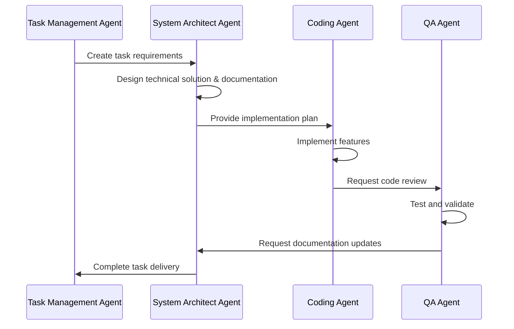

# Task Management Agent Specification

## Overview

Comprehensive specification for a Task Management Agent designed specifically for the LocalRetrieve project, implementing professional SDLC practices with AI agent-driven development.

## Core Capabilities

### 1. Sprint Planning & Task Coordination
- **Sprint Planning**: Automated sprint planning based on team capacity and task priorities
- **Task Lifecycle Management**: Complete task creation, tracking, and completion workflow
- **Resource Allocation**: Intelligent assignment of tasks to appropriate AI agents
- **Timeline Estimation**: Advanced estimation using historical data and complexity analysis

### 2. Progress Monitoring & Reporting
- **Real-time Progress Tracking**: Continuous monitoring of task progress across all phases
- **Burndown Analytics**: Automated burndown chart generation and velocity tracking
- **Risk Assessment**: Proactive risk identification and mitigation planning
- **Quality Gate Validation**: Automated quality checks and gate enforcement

### 3. Agent Coordination
- **Workflow Orchestration**: Coordinated workflow between System Architect, Coding, and QA agents
- **Task Assignment**: Intelligent task routing based on agent capabilities and workload
- **Progress Synchronization**: Real-time coordination and status updates between agents
- **Quality Assurance**: End-to-end quality validation across the development pipeline

### 4. Integration & Automation
- **File System Integration**: Direct integration with `/tasks/` directory structure
- **Git Workflow Automation**: Automated branch creation, PR management, and code review initiation
- **Documentation Synchronization**: Automatic updates to project documentation
- **CI/CD Integration**: Integration with build and deployment pipelines

## Technical Architecture

### Core Interfaces

```typescript
interface TaskManagementAgent {
  // Sprint Planning
  planSprint(requirements: SprintRequirements): SprintPlan;
  estimateTasks(tasks: TaskDefinition[]): TaskEstimation[];
  prioritizeTasks(tasks: TaskDefinition[]): TaskPriority[];

  // Task Lifecycle
  createTask(requirements: TaskRequirements): TaskDefinition;
  updateTaskStatus(taskId: string, status: TaskStatus): void;
  trackProgress(taskId: string): ProgressReport;

  // Risk Management
  assessRisks(project: ProjectContext): RiskAssessment;
  mitigateRisk(risk: Risk): MitigationPlan;

  // Agent Coordination
  coordinateAgentWorkflow(task: TaskDefinition): WorkflowCoordination;
  assignImplementationTask(task: TaskDefinition): Implementation;
  scheduleQualityReview(task: TaskDefinition): QualityReview;

  // Integration
  scanTaskDirectory(): TaskDirectoryStructure;
  createFeatureBranch(task: TaskDefinition): GitBranch;
  generateProgressReport(): SprintReport;
}
```

### Key Data Structures

- **TaskDefinition**: Complete task specification with BDD acceptance criteria
- **SprintPlan**: Comprehensive sprint planning with capacity and risk assessment
- **ProgressReport**: Real-time progress tracking with metrics and predictions
- **RiskAssessment**: Proactive risk identification with mitigation strategies
- **WorkflowCoordination**: Agent coordination and synchronization management

### Agent Workflow Integration



## Implementation Features

### Agile/Scrum Implementation
- **Sprint Planning**: Automated capacity-based sprint planning
- **Daily Standups**: Automated daily progress reports
- **Retrospectives**: Automated sprint retrospective analysis
- **Continuous Improvement**: Data-driven process optimization

### Advanced Estimation Techniques
- **Planning Poker**: Multi-agent estimation consensus
- **Three-Point Estimation**: PERT-based estimation with confidence intervals
- **Monte Carlo Simulation**: Statistical sprint outcome prediction
- **Historical Analysis**: Learning from past performance data

### Risk Management Framework
- **Risk Categories**: Technical, Resource, Schedule, Quality, External, Business
- **Risk Assessment**: Probability × Impact severity calculation
- **Mitigation Strategies**: Avoid, Mitigate, Transfer, Accept
- **Continuous Monitoring**: Automated risk status tracking

### Quality Assurance Integration
- **Quality Gates**: Automated quality checkpoint validation
- **Code Review Orchestration**: Automated PR creation and review assignment
- **Testing Coordination**: Comprehensive testing strategy implementation
- **Performance Monitoring**: Continuous performance metrics tracking

## File System Integration

### Task Directory Structure
```
/tasks/TASK-XXX-name/
├── requirements.md        # BDD requirements and acceptance criteria
├── design.md             # Technical architecture and design decisions
├── breakdown.md          # Detailed work breakdown with phases
├── progress.md           # Real-time progress tracking
├── testing.md            # Comprehensive testing strategy
├── docs/                 # Task-specific documentation
│   ├── api-changes.md    # API change documentation
│   ├── examples/         # Code examples and usage
│   └── diagrams/         # Technical diagrams
└── COMPLETED.md          # Final summary upon completion
```

### Git Integration
- **Branch Management**: Automated feature branch creation (`feature/TASK-XXX-name`)
- **PR Automation**: Automated pull request creation with comprehensive descriptions
- **Code Review**: Automated reviewer assignment and quality checks
- **Merge Coordination**: Automated merge validation and post-merge actions

## API Design

### REST API Endpoints
- `GET/POST /tasks` - Task management operations
- `GET/POST /sprints` - Sprint planning and management
- `GET /metrics` - Progress and performance metrics
- `GET/POST /risks` - Risk management operations
- `POST /agents/coordinate` - Agent coordination endpoints

### WebSocket Integration
- Real-time task status updates
- Sprint progress notifications
- Risk alert broadcasting
- Agent coordination messages

## Best Practices Implementation

### Project Management Methodologies
- **Agile/Scrum**: Complete Scrum framework implementation
- **Kanban**: Visual workflow management
- **Risk Management**: PMBOK-based risk management
- **Quality Assurance**: IEEE software quality standards

### Estimation Techniques
- **Story Points**: Relative estimation with Fibonacci sequence
- **Time Boxing**: Sprint duration management
- **Velocity Tracking**: Historical performance analysis
- **Predictive Analytics**: Future sprint capacity prediction

### Continuous Improvement
- **Retrospective Analysis**: Automated sprint retrospectives
- **Metrics-Driven Improvement**: Data-based process optimization
- **Feedback Loops**: Continuous learning and adaptation
- **Knowledge Management**: Organizational learning capture

## Integration with LocalRetrieve

### Project-Specific Features
- **Vector Search Task Management**: Specialized handling of vector search implementations
- **WASM Build Coordination**: Integration with SQLite WASM build processes
- **Browser Compatibility Testing**: Automated cross-browser testing coordination
- **Performance Optimization**: Specialized performance testing for hybrid search

### Existing Agent Enhancement
- **System Architect Integration**: Enhanced with documentation responsibilities
- **Coding Agent Coordination**: Streamlined implementation workflow
- **QA Agent Planning**: When implemented, comprehensive testing coordination

## Success Metrics

### Technical Metrics
- **Sprint Velocity**: Consistent velocity improvement
- **Quality Metrics**: Reduced defect rates and improved code quality
- **Delivery Predictability**: Improved estimation accuracy
- **Risk Mitigation**: Proactive risk management effectiveness

### Process Metrics
- **Cycle Time**: Reduced task completion time
- **Throughput**: Increased task completion rate
- **Quality Gates**: Improved quality gate pass rates
- **Team Satisfaction**: Enhanced development experience

## Implementation Roadmap

### Phase 1: Core Implementation (2 weeks)
- Basic task management functionality
- File system integration
- Git workflow automation
- Agent coordination framework

### Phase 2: Advanced Features (2 weeks)
- Sprint planning automation
- Risk management system
- Progress tracking and reporting
- Quality gate integration

### Phase 3: Optimization (1 week)
- Performance optimization
- Advanced analytics
- Continuous improvement features
- Production deployment

## Conclusion

This Task Management Agent specification provides a comprehensive framework for professional project management within the LocalRetrieve ecosystem. It combines proven project management methodologies with AI agent-driven development to create an efficient, scalable, and quality-focused development process.

The implementation will transform LocalRetrieve from an excellent technical solution into a professionally managed development effort that can scale with team growth and feature complexity while maintaining high quality standards and predictable delivery timelines.