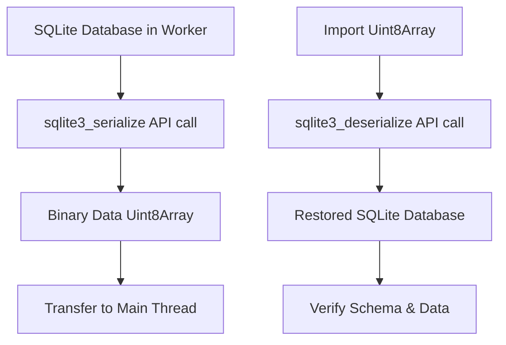

# TASK-001: Реализация SQLite Export/Import Функциональности

## Контекст и Обоснование
**Проблема**: В настоящее время export/import методы возвращают placeholder строки вместо реального SQLite бинарного дампа. Это критически важная функция для backup/restore.
**Цель**: Реализовать полнофункциональный экспорт/импорт базы данных используя SQLite C API
**Связь с архитектурой**: `/doc/target_architecture.md` секция "Backup & restore"

## Критерии Приемки (BDD-стиль)
- **Дано** база данных с индексированным контентом (документы + векторы)
- **Когда** вызывается db.export() или db.exportAsync()
- **Тогда** возвращается полный SQLite database dump как Uint8Array

- **Дано** экспортированный database dump как Uint8Array
- **Когда** вызывается Database.create(dumpData)
- **Тогда** база данных полностью восстанавливается со всеми данными

- **Дано** OPFS база данных с данными
- **Когда** выполняется export → import цикл
- **Тогда** все таблицы, индексы и данные идентичны оригиналу

## Техническое Планирование

### Компоненты для Изменения
- `src/database/worker.ts` (lines 642-681) - замена placeholder реализации
- `src/database/Database.ts` - убедиться что API правильно работает
- `examples/web-client/demo.js` - обновить UI для тестирования export/import
- `test-export-import.html` - добавить comprehensive тесты

### Архитектурное Решение


### API Изменения
Никаких изменений в публичном API, только внутренняя реализация:

```typescript
// Остается неизменным
class Database {
  export(): Uint8Array;
  exportAsync(): Promise<Uint8Array>;
  static create(data?: Uint8Array, filename?: string): Promise<Database>;
}
```

## План Реализации

### Этапы
1. **Исследование SQLite C API** (4 часа)
   - Изучить sqlite3_serialize/sqlite3_deserialize функции
   - Понять memory management для WASM
   - Исследовать existing WASM SQLite implementations

2. **Реализация export функциональности** (6 часов)
   - Заменить placeholder в handleExport (line 651)
   - Добавить proper error handling
   - Тестировать с разными размерами баз данных

3. **Реализация import функциональности** (4 часа)
   - Реализовать handleImport (lines 674-677)
   - Добавить validation импортируемых данных
   - Обеспечить совместимость с OPFS

4. **Интеграция и тестирование** (6 часов)
   - Обновить демо-приложение с export/import UI
   - Создать comprehensive test suite
   - Тестировать edge cases (большие базы, corrupted data)

### Потенциальные Риски
- **Риск 1**: SQLite serialize API может требовать специальную конфигурацию WASM build
  - **Митигация**: Проверить current build options, возможно потребуется rebuild
- **Риск 2**: Memory management в WASM может быть сложным для больших exports
  - **Митигация**: Реализовать streaming или chunked export при необходимости
- **Риск 3**: Совместимость версий SQLite между export/import
  - **Митигация**: Добавить версионные проверки и migration logic

## Детальный План Реализации

### В src/database/worker.ts

#### Шаг 1: Обновить handleExport (line 651)
```typescript
async handleExport(): Promise<Uint8Array> {
  try {
    if (!this.db) {
      throw new DatabaseError('Database not open');
    }

    // Использовать sqlite3_serialize API
    const serialized = this.db.serialize();
    console.log(`Database exported: ${serialized.length} bytes`);
    return serialized;
  } catch (error) {
    console.error('Export failed:', error);
    throw new DatabaseError(`Export failed: ${error.message}`);
  }
}
```

#### Шаг 2: Реализовать handleImport (lines 674-677)
```typescript
async handleImport(data: Uint8Array, filename?: string): Promise<void> {
  try {
    // Закрыть существующую базу если открыта
    if (this.db) {
      this.db.close();
    }

    // Создать новую базу из импортированных данных
    this.db = new SQL.Database(data);
    this.isOpen = true;

    // Если указан filename для OPFS, сохранить
    if (filename && filename.startsWith('opfs:/')) {
      this.filename = filename;
      await this.initializeOPFS();
      await this.saveDatabaseToOPFS();
    }

    console.log('Database imported successfully');
  } catch (error) {
    console.error('Import failed:', error);
    throw new DatabaseError(`Import failed: ${error.message}`);
  }
}
```

### В examples/web-client/demo.js

#### Добавить Export/Import UI
```javascript
// Export функциональность
async function exportDatabase() {
  try {
    const data = await db.exportAsync();
    const blob = new Blob([data], { type: 'application/octet-stream' });
    const url = URL.createObjectURL(blob);
    const a = document.createElement('a');
    a.href = url;
    a.download = 'localretrieve-backup.db';
    a.click();
    URL.revokeObjectURL(url);
  } catch (error) {
    console.error('Export failed:', error);
  }
}

// Import функциональность
async function importDatabase(file) {
  try {
    const data = new Uint8Array(await file.arrayBuffer());
    await db.closeAsync();
    db = await Database.create(data, 'opfs:/localretrieve-demo/demo.db');
    updateStats();
    console.log('Database imported successfully');
  } catch (error) {
    console.error('Import failed:', error);
  }
}
```

## Критерии Готовности (Definition of Done)
- [x] Изучены SQLite serialize/deserialize API
- [ ] handleExport возвращает реальный SQLite binary dump
- [ ] handleImport успешно восстанавливает базу из dump
- [ ] Export/import работает с OPFS persistence
- [ ] Демо-приложение имеет working export/import UI
- [ ] Comprehensive тесты покрывают edge cases
- [ ] Документация обновлена с примерами использования
- [ ] Performance приемлема для типичных размеров баз данных
- [ ] Нет memory leaks при export/import больших баз

## Связанные Задачи
- Блокирует: TASK-002 (Demo Completion)
- Блокирует: MVP Release v0.2.0
- Связано с: `/doc/target_architecture.md` Backup & restore
- Связано с: `README.md` Export/import API documentation

## Оценка
**Сложность**: High (требует глубокое понимание SQLite C API в WASM)
**Оценка времени**: 2-3 дня
**Приоритет**: Critical (блокирует релиз)

## Статус
- [ ] Не начато
- [ ] В работе
- [ ] Код-ревью
- [ ] Готово к тестированию
- [ ] Завершено

## Примечания
- SQLite serialize/deserialize API документация: https://www.sqlite.org/c3ref/serialize.html
- Проверить поддержку в текущем WASM build
- Возможно потребуется обновление build pipeline если API не включен