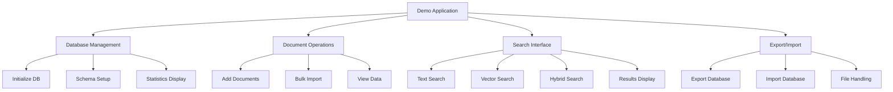

# TASK-002: Завершение Демо-Приложения

## Контекст и Обоснование
**Проблема**: Демо-приложение существует но не полностью реализованы все функции. Export/import UI отсутствует, UX можно улучшить.
**Цель**: Создать полнофункциональное демо-приложение, демонстрирующее все возможности LocalRetrieve
**Связь с архитектурой**: `/doc/vision.md` секция "Product surface" - демонстрация публичного SDK

## Критерии Приемки (BDD-стиль)
- **Дано** пользователь открывает демо-приложение
- **Когда** он взаимодействует с интерфейсом
- **Тогда** все основные функции SDK доступны и работают

- **Дано** пользователь хочет сохранить данные
- **Когда** он нажимает Export
- **Тогда** база данных скачивается как файл

- **Дано** пользователь имеет backup файл
- **Когда** он загружает файл через Import
- **Тогда** данные восстанавливаются и отображаются

## Техническое Планирование

### Компоненты для Изменения
- `examples/web-client/index.html` - обновить UI layout
- `examples/web-client/demo.js` - добавить недостающую функциональность
- `examples/web-client/style.css` - улучшить стилизацию
- `examples/web-client/test-data.js` - расширить тестовые данные

### Архитектурное Решение


### Новые UI Компоненты
```html
<!-- Export/Import Section -->
<div class="export-import-section">
  <h3>Backup & Restore</h3>
  <button id="exportBtn">Export Database</button>
  <input type="file" id="importInput" accept=".db" style="display: none;">
  <button id="importBtn">Import Database</button>
</div>

<!-- Advanced Search Options -->
<div class="search-options">
  <label>Fusion Method:
    <select id="fusionMethod">
      <option value="rrf">RRF (Default)</option>
      <option value="weighted">Weighted</option>
    </select>
  </label>
  <label>Results Limit:
    <input type="number" id="resultsLimit" value="10" min="1" max="50">
  </label>
</div>
```

## План Реализации

### Этапы
1. **UI/UX Улучшения** (6 часов)
   - Реорганизовать layout для лучшей навигации
   - Добавить секции для всех функций
   - Улучшить responsive design
   - Добавить loading states и error handling

2. **Export/Import Функциональность** (4 часа)
   - Реализовать export database с download
   - Реализовать import database с file picker
   - Добавить validation и error handling
   - Интегрировать с TASK-001

3. **Расширенные Search опции** (3 часов)
   - Добавить fusion method selector
   - Добавить результат limit control
   - Показать search performance metrics
   - Улучшить results display

4. **Улучшения Данных и Тестирования** (3 часа)
   - Расширить test-data.js с более реалистичными данными
   - Добавить bulk import functionality
   - Улучшить statistics display
   - Добавить clear database functionality

### Детальный План UI

#### Обновления index.html
```html
<!DOCTYPE html>
<html lang="en">
<head>
    <meta charset="UTF-8">
    <meta name="viewport" content="width=device-width, initial-scale=1.0">
    <title>LocalRetrieve Demo - Hybrid Search in Browser</title>
    <link rel="stylesheet" href="style.css">
</head>
<body>
    <header>
        <h1>LocalRetrieve Demo</h1>
        <p>Browser-native hybrid search with SQLite WASM + sqlite-vec</p>
    </header>

    <main class="container">
        <!-- Database Status -->
        <section class="status-section">
            <h2>Database Status</h2>
            <div id="dbStatus" class="status-grid">
                <div class="stat-card">
                    <h3 id="docCount">0</h3>
                    <p>Documents</p>
                </div>
                <div class="stat-card">
                    <h3 id="vectorCount">0</h3>
                    <p>Vectors</p>
                </div>
                <div class="stat-card">
                    <h3 id="dbSize">0 KB</h3>
                    <p>Database Size</p>
                </div>
                <div class="stat-card">
                    <h3 id="lastSync">Never</h3>
                    <p>Last OPFS Sync</p>
                </div>
            </div>
        </section>

        <!-- Data Management -->
        <section class="data-section">
            <h2>Data Management</h2>
            <div class="controls-grid">
                <div class="control-group">
                    <h3>Add Documents</h3>
                    <textarea id="docTitle" placeholder="Document title"></textarea>
                    <textarea id="docContent" placeholder="Document content"></textarea>
                    <button id="addDocBtn">Add Document</button>
                </div>
                <div class="control-group">
                    <h3>Bulk Operations</h3>
                    <button id="loadSampleBtn">Load Sample Data</button>
                    <button id="clearDbBtn">Clear Database</button>
                </div>
                <div class="control-group">
                    <h3>Backup & Restore</h3>
                    <button id="exportBtn">Export Database</button>
                    <input type="file" id="importInput" accept=".db" style="display: none;">
                    <button id="importBtn">Import Database</button>
                </div>
            </div>
        </section>

        <!-- Search Interface -->
        <section class="search-section">
            <h2>Hybrid Search</h2>
            <div class="search-controls">
                <div class="search-inputs">
                    <input type="text" id="textQuery" placeholder="Text search query...">
                    <textarea id="vectorInput" placeholder="Enter vector (384 comma-separated numbers)"></textarea>
                </div>
                <div class="search-options">
                    <select id="fusionMethod">
                        <option value="rrf">RRF Fusion</option>
                        <option value="weighted">Weighted Fusion</option>
                    </select>
                    <input type="number" id="resultsLimit" value="10" min="1" max="50">
                    <button id="searchBtn">Search</button>
                </div>
            </div>
            <div id="searchResults"></div>
        </section>

        <!-- Raw SQL Interface -->
        <section class="sql-section">
            <h2>Raw SQL Interface</h2>
            <textarea id="sqlQuery" placeholder="Enter SQL query..."></textarea>
            <button id="execSqlBtn">Execute SQL</button>
            <div id="sqlResults"></div>
        </section>
    </main>

    <script type="module" src="demo.js"></script>
</body>
</html>
```

#### Ключевые JavaScript функции

```javascript
// Export/Import функциональность
async function exportDatabase() {
    try {
        showLoading('Exporting database...');
        const data = await db.exportAsync();
        const blob = new Blob([data], { type: 'application/octet-stream' });
        const url = URL.createObjectURL(blob);

        const a = document.createElement('a');
        a.href = url;
        a.download = `localretrieve-backup-${new Date().toISOString().split('T')[0]}.db`;
        a.click();

        URL.revokeObjectURL(url);
        showSuccess('Database exported successfully');
    } catch (error) {
        showError('Export failed: ' + error.message);
    } finally {
        hideLoading();
    }
}

// Улучшенный search с опциями
async function performSearch() {
    const textQuery = document.getElementById('textQuery').value.trim();
    const vectorInput = document.getElementById('vectorInput').value.trim();
    const fusionMethod = document.getElementById('fusionMethod').value;
    const limit = parseInt(document.getElementById('resultsLimit').value);

    if (!textQuery && !vectorInput) {
        showError('Please enter text query or vector');
        return;
    }

    try {
        showLoading('Searching...');
        const startTime = performance.now();

        const searchRequest = {
            query: {},
            limit: limit,
            fusion: { method: fusionMethod }
        };

        if (textQuery) {
            searchRequest.query.text = textQuery;
        }

        if (vectorInput) {
            const vector = parseVector(vectorInput);
            searchRequest.query.vector = new Float32Array(vector);
        }

        const results = await db.search(searchRequest);
        const searchTime = performance.now() - startTime;

        displaySearchResults(results, searchTime);
    } catch (error) {
        showError('Search failed: ' + error.message);
    } finally {
        hideLoading();
    }
}
```

## Критерии Готовности (Definition of Done)
- [ ] Все основные функции SDK имеют UI
- [ ] Export/import полностью работает с TASK-001
- [ ] Responsive design работает на мобильных устройствах
- [ ] Error handling для всех user actions
- [ ] Loading states для async operations
- [ ] Performance metrics отображаются для search
- [ ] Sample data демонстрирует real-world use cases
- [ ] Cross-browser compatibility проверена
- [ ] UI интуитивно понятен для new users

## Связанные Задачи
- Зависит от: TASK-001 (Export/Import)
- Связано с: README.md Quick Start section
- Связано с: `/doc/vision.md` Product surface demonstration

## Оценка
**Сложность**: Medium
**Оценка времени**: 2 дня
**Приоритет**: High

## Статус
- [ ] Не начато
- [ ] В работе - UI design
- [ ] В работе - functionality
- [ ] Код-ревью
- [ ] Готово к тестированию
- [ ] Завершено

## Дополнительные Требования

### Accessibility
- Keyboard navigation для всех controls
- Screen reader friendly labels
- High contrast colors
- Focus indicators

### Performance
- Lazy loading для больших result sets
- Debounced search input
- Minimal reflows при UI updates
- Efficient DOM manipulation

### User Experience
- Clear visual feedback для всех actions
- Helpful error messages
- Contextual help text
- Smooth transitions