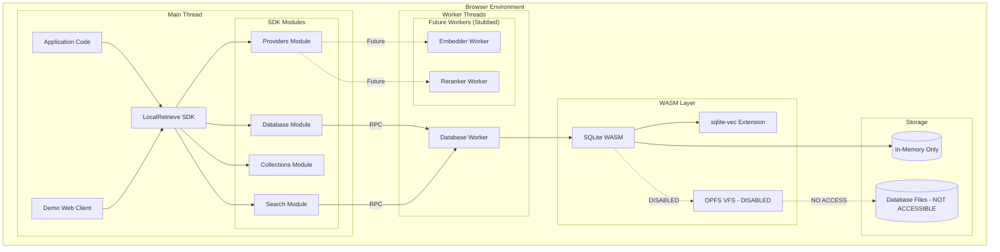
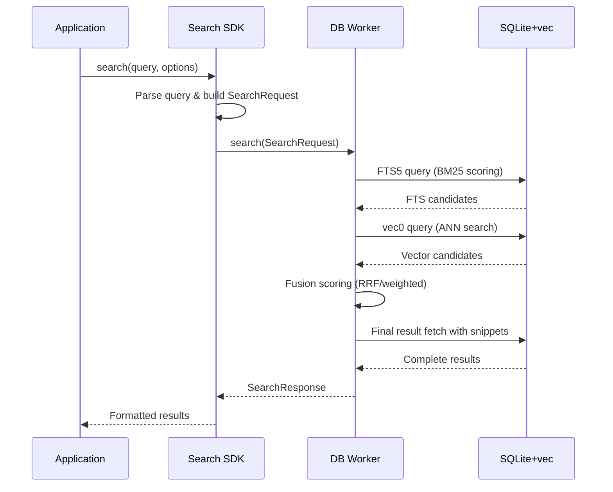
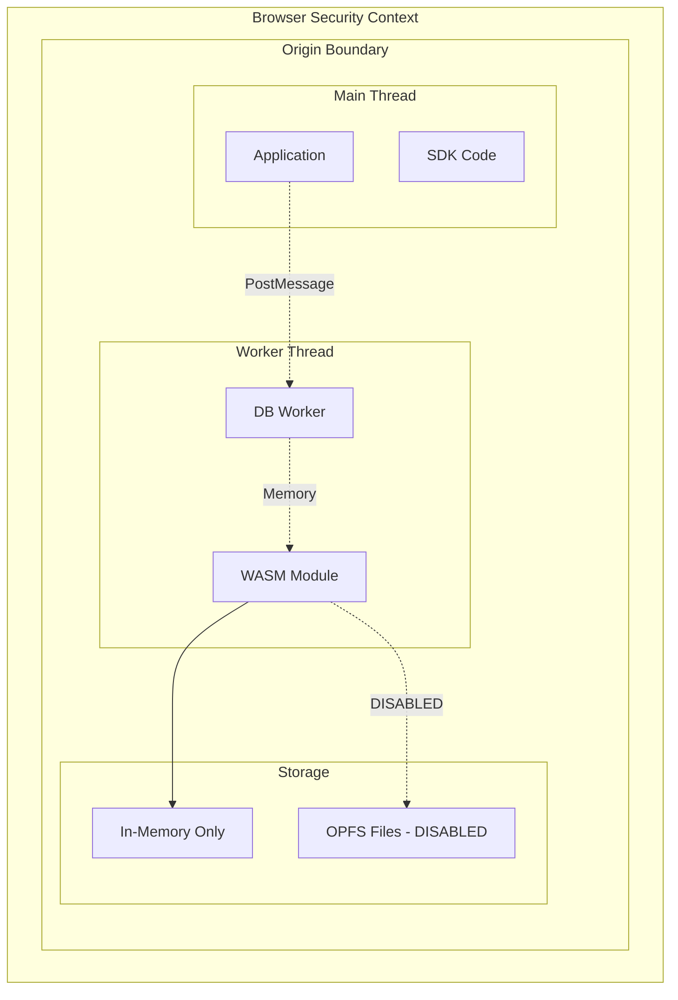

# LocalRetrieve MVP Architecture

## Architecture Overview

**CURRENT STATUS**: The MVP has partially implemented the target architecture with working hybrid search but critical persistence issues.

**Implementation Status**: ✅ Hybrid Search Core | ❌ OPFS Persistence | ❌ Export/Import

The architecture focuses on sql.js compatibility and hybrid search functionality, with some components implemented as placeholders.

### Core Principles

1. **Single Responsibility Workers**: Each worker type handles specific concerns (DB, future: Embedder, Reranker)
2. **Future-Compatible APIs**: Interfaces designed to support target features without breaking changes
3. **Extensible Data Model**: Schema supports multi-collection/multi-vector without core changes
4. **Provider Abstraction**: Pluggable providers for embeddings and reranking (stubbed in MVP)

## System Architecture



## Component Architecture

### 1. Database Worker (Core MVP Component)

**Responsibilities (Actual Implementation)**:
- ✅ SQLite WASM module management
- ✅ Manual sqlite-vec extension initialization
- ❌ OPFS file operations (disabled, uses :memory: only)
- ✅ SQL query execution via C API
- ✅ Advanced hybrid search orchestration (FTS5 + vec0)
- ❌ Data export/import (placeholder implementation only)

**Interface**:
```typescript
interface DBWorkerAPI {
  // Core SQL operations (sql.js compatible)
  open(filename: string): Promise<void>
  initVecExtension(): Promise<void>  // Manual vec init required for WASM
  exec(sql: string, params?: SQLValue[]): Promise<void>
  select(sql: string, params?: SQLValue[]): Promise<Row[]>
  bulkInsert(table: string, rows: Record<string, any>[]): Promise<void>
  export(): Promise<Uint8Array>
  close(): Promise<void>
  
  // High-level search (MVP implementation)
  search(request: SearchRequest): Promise<SearchResponse>
  
  // Collection management (MVP: single collection)
  initializeSchema(): Promise<void>
  getCollectionInfo(name: string): Promise<CollectionInfo>
}
```

### 2. TypeScript SDK (Main Thread)

**Module Structure**:

#### Database Module (`src/core/sdk/database/`)
- `Database.ts` - sql.js compatibility wrapper
- `Connection.ts` - Worker connection management
- `Transaction.ts` - Transaction handling (future)

#### Search Module (`src/core/sdk/search/`)
- `SearchEngine.ts` - High-level search orchestration
- `FusionEngine.ts` - Result fusion logic (RRF, weighted)
- `QueryBuilder.ts` - SQL query generation helpers

#### Collections Module (`src/core/sdk/collections/`)
- `CollectionManager.ts` - Collection lifecycle management
- `Schema.ts` - Collection schema definitions
- `Migration.ts` - Schema migration utilities

#### Providers Module (`src/core/sdk/providers/`)
- `EmbedderProvider.ts` - Embedding provider interface
- `RerankerProvider.ts` - Reranking provider interface
- `LocalProvider.ts` - Stub local provider implementations

### 3. Data Architecture

#### Registry Tables (Multi-collection ready)
```sql
-- Collections metadata
CREATE TABLE collections (
  name TEXT PRIMARY KEY,
  created_at INTEGER,
  schema_version INTEGER,
  config JSON
);

-- Vector field configurations
CREATE TABLE collection_vectors (
  collection TEXT,
  vector_name TEXT,
  dim INTEGER,
  metric TEXT,
  type TEXT,
  config JSON,
  UNIQUE(collection, vector_name)
);

-- Provider configurations (future)
CREATE TABLE provider_registry (
  name TEXT PRIMARY KEY,
  type TEXT, -- 'embedder' | 'reranker'
  config JSON,
  enabled BOOLEAN
);
```

#### Collection Tables Pattern
For each collection `{name}`, create:
- `docs_{name}` - Base document storage
- `fts_{name}` - FTS5 virtual table
- `vec_{name}_{vector}` - vec0 virtual table per vector field

**MVP Default Collection**:
```sql
-- Base documents
CREATE TABLE docs_default (
  rowid INTEGER PRIMARY KEY,
  id TEXT UNIQUE,
  title TEXT,
  content TEXT,
  created_at INTEGER,
  metadata JSON
);

-- Full-text search
CREATE VIRTUAL TABLE fts_default USING fts5(
  id UNINDEXED,
  title,
  content,
  tokenize = "unicode61 remove_diacritics 2"
);

-- Vector search (384-dim embeddings)
CREATE VIRTUAL TABLE vec_default_dense USING vec0(
  rowid INTEGER PRIMARY KEY,
  embedding float[384]
);
```

### 4. Search Pipeline Architecture

#### Query Flow


#### Fusion Algorithms (MVP)
1. **Reciprocal Rank Fusion (RRF)**:
   ```
   score = 1/(k + rank_fts) + 1/(k + rank_vec)
   where k = 60 (standard RRF parameter)
   ```

2. **Weighted Fusion**:
   ```
   score = w_fts * normalize(fts_score) + w_vec * normalize(vec_score)
   where w_fts + w_vec = 1.0
   ```

## Extension Points & Future Compatibility

### 1. Multi-Collection Extension
**MVP State**: Single "default" collection
**Extension Path**:
- Collection creation API already defined in DBWorkerAPI
- Table naming pattern `{type}_{collection}_{vector?}` established
- Registry tables support multiple collections
- SDK CollectionManager ready for multi-collection operations

### 2. Multi-Vector Extension
**MVP State**: Single dense vector (384-dim)
**Extension Path**:
- `collection_vectors` registry supports multiple vectors per collection
- Table pattern `vec_{collection}_{vector_name}` established
- SearchRequest supports vector field selection (stubbed)
- Query builder supports multi-vector joins

### 3. Provider Extension
**MVP State**: Manual vector input, no embedders/rerankers
**Extension Path**:
```typescript
// MVP stub implementations
class StubEmbedderProvider implements EmbedderProvider {
  async embed(texts: string[]): Promise<Float32Array[]> {
    throw new Error("Manual vectors required in MVP");
  }
  info() { return { name: "manual", dim: 384, device: "none" }; }
}

// Future local provider
class LocalEmbedderProvider implements EmbedderProvider {
  constructor(private model: ONNXModel) {}
  async embed(texts: string[]): Promise<Float32Array[]> {
    return this.model.encode(texts);
  }
  info() { return { name: this.model.name, dim: this.model.dim, device: "webgpu" }; }
}
```

### 4. Search Pipeline Extension
**MVP State**: Simple FTS + vector fusion
**Extension Path**:
- SearchRequest interface supports all target features (filters, rerank, groupBy)
- Fusion algorithms pluggable via strategy pattern
- Pipeline supports pre/post-processing hooks
- Worker search() method can route to specialized workers

## Configuration Architecture

### Build-time Configuration
```typescript
interface BuildConfig {
  target: 'mvp' | 'full';
  features: {
    multiCollection: boolean;
    encryption: boolean;
    remoteProviders: boolean;
    reranking: boolean;
  };
  wasm: {
    optimization: 'size' | 'speed';
    threading: boolean;
    simd: boolean;
  };
}
```

### Runtime Configuration
```typescript
interface RuntimeConfig {
  database: {
    filename: string;
    vfs: 'opfs' | 'opfs-sahpool';
    pragmas: Record<string, string>;
  };
  providers: {
    embedder: ProviderConfig;
    reranker: ProviderConfig;
  };
  search: {
    defaultLimit: number;
    fusionMethod: 'rrf' | 'weighted';
    fusionWeights: { fts: number; vec: number };
  };
}
```

## Security Architecture

### **ACTUAL** MVP Security Model
- ✅ **Sandboxing**: WASM execution in browser security context
- ✅ **Isolation**: Web Workers prevent main thread blocking/interference
- ❌ **Data Locality**: Data is in-memory only (OPFS disabled)
- ✅ **No Network**: MVP has no remote communication surface
- ⚠️ **Data Persistence**: All data lost on page refresh (security risk for users)

### Security Boundaries


### Future Security Extensions
- At-rest encryption via WebCrypto AES-GCM
- Provider allowlisting and host pinning
- Audit logging for data access
- CSP and Trusted Types integration

## Performance Architecture

### Performance Budget (MVP Targets)
- **Cold start**: Engine ready < 300ms
- **First query**: < 800ms (no model warmup)
- **Hybrid search**: p95 < 500ms on 10k documents
- **Memory footprint**: < 256MB total
- **Bundle size**: WASM + SDK < 6MB

### Performance Optimizations

#### WASM Optimizations
```bash
# Build flags for performance
CFLAGS="-O2 -DSQLITE_ENABLE_FTS5 -DSQLITE_ENABLE_RTREE"
EMFLAGS="-sALLOW_MEMORY_GROWTH=1 -sWASM_BIGINT -sSIMD=1"
```

#### SQLite Tuning
```sql
-- Performance PRAGMAs
PRAGMA synchronous = NORMAL;
PRAGMA journal_mode = WAL;
PRAGMA cache_size = -64000;  -- 64MB cache
PRAGMA temp_store = MEMORY;
PRAGMA mmap_size = 268435456; -- 256MB mmap
```

#### Query Optimization
```sql
-- Optimized hybrid search query
WITH fts_results AS (
  SELECT rowid, bm25(fts_default) as fts_score, rank() OVER (ORDER BY bm25(fts_default)) as fts_rank
  FROM fts_default WHERE fts_default MATCH ? LIMIT ?
),
vec_results AS (
  SELECT rowid, distance as vec_score, rank() OVER (ORDER BY distance) as vec_rank
  FROM vec_default_dense WHERE embedding MATCH vec_f32(?) AND k = ?
)
SELECT
  d.rowid, d.id, d.title, d.content,
  f.fts_score, v.vec_score,
  (1.0/(60 + f.fts_rank) + 1.0/(60 + v.vec_rank)) as fusion_score
FROM fts_results f
JOIN vec_results v ON f.rowid = v.rowid
JOIN docs_default d ON d.rowid = f.rowid
ORDER BY fusion_score DESC LIMIT ?;
```

## Deployment Architecture

### Static Hosting Requirements
```yaml
# Minimal hosting setup
server:
  headers:
    Cross-Origin-Opener-Policy: same-origin
    Cross-Origin-Embedder-Policy: require-corp
  compression: gzip
  cache:
    wasm: max-age=31536000  # 1 year
    js: max-age=86400       # 1 day
```

### Asset Structure
```
dist/
├── localretrieve.mjs          # Main SDK module
├── localretrieve.d.ts         # TypeScript definitions
├── sqlite3.wasm               # SQLite+vec WASM
├── sqlite3.mjs                # WASM loader
├── db-worker.js               # Database worker
├── sqlite3-opfs-async-proxy.js # OPFS helper
└── examples/
    └── web-client/
        ├── index.html
        ├── demo.js
        └── demo.css
```

### Integration Patterns

#### Vite/Webpack Integration
```typescript
// vite.config.ts
export default defineConfig({
  worker: {
    format: 'es'
  },
  server: {
    headers: {
      'Cross-Origin-Opener-Policy': 'same-origin',
      'Cross-Origin-Embedder-Policy': 'require-corp'
    }
  },
  build: {
    rollupOptions: {
      external: ['./sqlite3.wasm']
    }
  }
});
```

#### CDN Usage
```html
<!-- CDN integration -->
<script type="module">
  import { Database } from 'https://cdn.jsdelivr.net/npm/localretrieve@1.0.0/dist/localretrieve.mjs';
  
  const db = await Database.create('opfs:/myapp/search.db');
  // Ready to use
</script>
```

## Migration & Versioning Strategy

### Schema Versioning
```sql
-- Version management
PRAGMA user_version = 1;

-- Migration tracking
CREATE TABLE IF NOT EXISTS schema_migrations (
  version INTEGER PRIMARY KEY,
  applied_at INTEGER,
  description TEXT
);
```

### SDK Versioning
```typescript
interface VersionInfo {
  sdk: string;        // "1.0.0"
  wasm: string;       // "sqlite-3.47.0+vec-0.1.0"
  schema: number;     // 1
  features: string[]; // ["fts5", "vec", "opfs"]
}

// Compatibility checking
class Migration {
  static async checkCompatibility(db: Database): Promise<boolean> {
    const version = await db.getUserVersion();
    return version <= CURRENT_SCHEMA_VERSION;
  }
  
  static async migrate(db: Database, targetVersion: number): Promise<void> {
    // Progressive migration logic
  }
}
```

### Backward Compatibility
- sql.js API surface remains stable
- New features added as optional parameters
- Graceful degradation for unsupported features
- Clear deprecation cycle for breaking changes