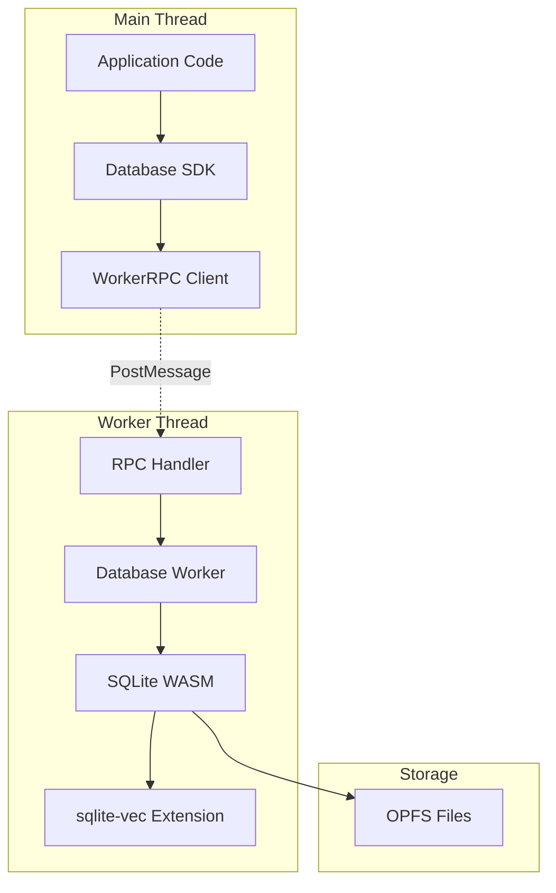

# Database Worker + RPC Interface Documentation

## Overview

The Database Worker + RPC Interface provides a robust, non-blocking database layer for LocalRetrieve MVP. It implements SQLite WASM with sqlite-vec extension in a Web Worker, with message-based RPC communication and OPFS persistence.

## Architecture



## Core Components

### 1. WorkerRPC Client (`src/utils/rpc.ts`)

**Purpose**: Provides a typed RPC client that communicates with the database worker.

**Key Features**:
- Type-safe method calls
- Automatic timeout handling
- Concurrent operation management
- Performance monitoring
- Error recovery

**Usage**:
```typescript
import { WorkerRPC } from '../utils/rpc.js';

// Create worker RPC instance
const worker = new Worker('./database/worker.js', { type: 'module' });
const db = new WorkerRPC(worker, {
  maxConcurrentOperations: 10,
  operationTimeout: 30000,
  logLevel: 'info'
});

// Use the database
await db.open({ filename: 'opfs:/myapp/database.db' });
await db.initVecExtension();
await db.initializeSchema();
```

### 2. Database Worker (`src/database/worker.ts`)

**Purpose**: Handles SQLite WASM operations in a dedicated Web Worker thread.

**Key Features**:
- WASM module loading and initialization
- Manual sqlite-vec extension setup
- OPFS persistence
- SQL operation execution
- Hybrid search implementation
- Connection state management

## API Reference

### Database Operations

#### `open(params: OpenDatabaseParams): Promise<void>`

Opens a database connection with OPFS persistence.

**Parameters**:
```typescript
interface OpenDatabaseParams {
  filename: string;           // Database filename (use "opfs:/path/to/db.sqlite" for OPFS)
  vfs?: 'opfs' | 'opfs-sahpool'; // VFS type (default: 'opfs')
  pragmas?: Record<string, string>; // SQLite PRAGMAs
}
```

**Example**:
```typescript
await db.open({
  filename: 'opfs:/myapp/search.db',
  vfs: 'opfs',
  pragmas: {
    synchronous: 'NORMAL',
    cache_size: '-64000',
    journal_mode: 'WAL'
  }
});
```

#### `initVecExtension(): Promise<void>`

Manually initializes the sqlite-vec extension (required for WASM builds).

**Example**:
```typescript
await db.initVecExtension();
// Now vec0 virtual tables are available
```

#### `initializeSchema(): Promise<void>`

Creates the default collection schema with FTS and vector tables.

**Creates**:
- `docs_default` - Base document storage
- `fts_default` - FTS5 virtual table for text search
- `vec_default_dense` - vec0 virtual table for vector search
- `collections` - Collection metadata table

**Example**:
```typescript
await db.initializeSchema();
```

#### `exec(params: ExecParams): Promise<void>`

Executes SQL statements (INSERT, UPDATE, DELETE, DDL).

**Parameters**:
```typescript
interface ExecParams {
  sql: string;
  params?: SQLValue[] | Record<string, SQLValue>;
}
```

**Example**:
```typescript
await db.exec({
  sql: 'INSERT INTO docs_default (id, title, content) VALUES (?, ?, ?)',
  params: ['doc1', 'Title', 'Content']
});
```

#### `select(params: SelectParams): Promise<QueryResult>`

Executes SELECT queries and returns results.

**Example**:
```typescript
const result = await db.select({
  sql: 'SELECT * FROM docs_default WHERE id = ?',
  params: ['doc1']
});

console.log(result.rows); // Array of result objects
```

#### `bulkInsert(params: BulkInsertParams): Promise<void>`

Efficiently inserts multiple rows using transactions.

**Example**:
```typescript
await db.bulkInsert({
  table: 'docs_default',
  rows: [
    { id: 'doc1', title: 'Title 1', content: 'Content 1' },
    { id: 'doc2', title: 'Title 2', content: 'Content 2' }
  ],
  batchSize: 1000
});
```

### Search Operations

#### `search(params: SearchRequest): Promise<SearchResponse>`

Performs hybrid search combining FTS5 and vector similarity.

**Parameters**:
```typescript
interface SearchRequest {
  query: {
    text?: string;           // Text query for FTS
    vector?: Float32Array;   // Query vector for similarity search
    filters?: Record<string, any>; // Additional filters (future)
  };
  collection?: string;       // Collection name (default: 'default')
  limit?: number;           // Result limit (default: 10)
  fusionMethod?: 'rrf' | 'weighted'; // Fusion algorithm
  fusionWeights?: { fts: number; vec: number }; // Weights for weighted fusion
}
```

**Example**:
```typescript
const queryVector = new Float32Array(384); // Your query embedding
// ... populate queryVector ...

const results = await db.search({
  query: {
    text: 'machine learning',
    vector: queryVector
  },
  limit: 20,
  fusionMethod: 'rrf'
});

for (const result of results.results) {
  console.log(`${result.title}: ${result.score.toFixed(3)}`);
}
```

### Data Management

#### `export(params?: ExportParams): Promise<Uint8Array>`

Exports the database as a binary SQLite file.

**Example**:
```typescript
const dbData = await db.export();
const blob = new Blob([dbData], { type: 'application/octet-stream' });
// Save or transfer the blob
```

#### `import(params: ImportParams): Promise<void>`

Imports a SQLite database from binary data.

**Example**:
```typescript
const fileData = await file.arrayBuffer();
await db.import({
  data: new Uint8Array(fileData),
  overwrite: true
});
```

### Utility Operations

#### `getVersion(): Promise<VersionInfo>`

Returns version information for all components.

**Example**:
```typescript
const version = await db.getVersion();
console.log(`SQLite: ${version.sqlite}, vec: ${version.vec}, SDK: ${version.sdk}`);
```

#### `getStats(): Promise<DatabaseStats>`

Returns database statistics and performance metrics.

**Example**:
```typescript
const stats = await db.getStats();
console.log(`DB Size: ${stats.dbSize} bytes, Operations: ${stats.operations}`);
```

#### `close(): Promise<void>`

Closes the database connection and cleans up resources.

**Example**:
```typescript
await db.close();
```

## Error Handling

### Error Types

The worker interface defines several specific error types:

```typescript
class WorkerError extends Error {
  constructor(message: string, public code?: string, public details?: any)
}

class DatabaseError extends WorkerError {
  constructor(message: string, public sqliteCode?: number)
}

class VectorError extends WorkerError {
  constructor(message: string)
}

class OPFSError extends WorkerError {
  constructor(message: string)
}
```

### Error Handling Patterns

```typescript
try {
  await db.exec({ sql: 'INSERT INTO docs_default ...' });
} catch (error) {
  if (error instanceof DatabaseError) {
    console.error('Database error:', error.message, error.sqliteCode);
  } else if (error instanceof OPFSError) {
    console.error('Storage error:', error.message);
  } else {
    console.error('Unknown error:', error.message);
  }
}
```

## Multi-Tab Concurrency

### Cross-Tab Communication

The implementation supports multi-tab scenarios with coordination:

```typescript
// Initialize BroadcastChannel for tab communication
const channel = new BroadcastChannel('localretrieve-coordination');

// Handle cross-tab messages
channel.onmessage = (event) => {
  const { type, data } = event.data;
  
  switch (type) {
    case 'database_update':
      // Handle updates from other tabs
      break;
    case 'tab_closing':
      // Handle tab cleanup
      break;
  }
};

// Notify other tabs of changes
channel.postMessage({
  type: 'database_update',
  data: { collection: 'default', operation: 'insert' }
});
```

### Concurrency Best Practices

1. **Use transactions** for bulk operations
2. **Limit concurrent operations** to avoid overwhelming the worker
3. **Handle timeouts** gracefully
4. **Coordinate writes** across tabs when necessary

## OPFS Persistence

### File Storage

```typescript
// Persistent storage (survives browser restarts)
await db.open({ filename: 'opfs:/myapp/persistent.db' });

// Temporary storage (memory only)
await db.open({ filename: ':memory:' });
```

### Storage Management

```typescript
// Monitor storage usage
const estimate = await navigator.storage.estimate();
console.log(`Used: ${estimate.usage}, Quota: ${estimate.quota}`);

// Handle quota exceeded
try {
  await db.bulkInsert({ table: 'docs_default', rows: largeDataset });
} catch (error) {
  if (error instanceof OPFSError && error.message.includes('quota')) {
    // Implement cleanup or user notification
    await handleStorageQuotaExceeded();
  }
}
```

## Performance Optimization

### Configuration

```typescript
const db = new WorkerRPC(worker, {
  maxConcurrentOperations: 5,    // Limit concurrent operations
  operationTimeout: 30000,       // 30 second timeout
  enablePerformanceMonitoring: true
});
```

### Performance Monitoring

```typescript
// Get performance metrics
const metrics = db.getPerformanceMetrics();
console.log({
  averageLatency: metrics.averageLatency,
  successRate: metrics.successRate,
  pendingOperations: metrics.pendingOperations
});
```

### Query Optimization

```sql
-- Optimize FTS queries
SELECT * FROM fts_default WHERE fts_default MATCH 'query*' LIMIT 50;

-- Optimize vector queries
SELECT rowid, distance FROM vec_default_dense 
WHERE embedding MATCH vec_f32(?) AND k = 10;

-- Hybrid search with proper indexing
WITH fts_results AS (
  SELECT rowid, bm25(fts_default) as score, 
         rank() OVER (ORDER BY bm25(fts_default)) as rank
  FROM fts_default WHERE fts_default MATCH ? LIMIT ?
),
vec_results AS (
  SELECT rowid, distance, 
         rank() OVER (ORDER BY distance) as rank
  FROM vec_default_dense WHERE embedding MATCH vec_f32(?) AND k = ?
)
-- ... fusion logic
```

## Usage Examples

### Complete Workflow

```typescript
import { WorkerRPC } from './utils/rpc.js';

async function setupDatabase() {
  // 1. Create worker and RPC client
  const worker = new Worker('./database/worker.js', { type: 'module' });
  const db = new WorkerRPC(worker);

  // 2. Open database with OPFS persistence
  await db.open({ filename: 'opfs:/myapp/search.db' });

  // 3. Initialize sqlite-vec extension
  await db.initVecExtension();

  // 4. Create default schema
  await db.initializeSchema();

  return db;
}

async function indexDocuments(db, documents) {
  // 5. Index documents with vectors
  const rows = documents.map(doc => ({
    id: doc.id,
    title: doc.title,
    content: doc.content
  }));

  await db.bulkInsert({ table: 'docs_default', rows });

  // 6. Index in FTS
  for (const doc of documents) {
    await db.exec({
      sql: 'INSERT INTO fts_default (rowid, id, title, content) VALUES ((SELECT rowid FROM docs_default WHERE id = ?), ?, ?, ?)',
      params: [doc.id, doc.id, doc.title, doc.content]
    });

    // 7. Index vectors
    await db.exec({
      sql: 'INSERT INTO vec_default_dense (rowid, embedding) VALUES ((SELECT rowid FROM docs_default WHERE id = ?), vec_f32(?))',
      params: [doc.id, JSON.stringify(Array.from(doc.vector))]
    });
  }
}

async function performSearch(db, queryText, queryVector) {
  // 8. Perform hybrid search
  const results = await db.search({
    query: {
      text: queryText,
      vector: queryVector
    },
    limit: 10,
    fusionMethod: 'rrf'
  });

  return results.results;
}

// Usage
const db = await setupDatabase();
await indexDocuments(db, myDocuments);
const results = await performSearch(db, 'machine learning', queryEmbedding);
```

### Testing Integration

The implementation includes comprehensive testing with multi-tab concurrency:

- **Test 1-8**: Core functionality (WASM loading, database operations, hybrid search)
- **Test 9**: Multi-tab concurrency testing
- **Test 10**: Cross-tab communication and coordination

Run tests by opening `test-worker-integration.html` in your browser.

## Troubleshooting

### Common Issues

1. **"Database not open"**
   - Ensure `open()` is called before other operations
   - Check OPFS support in your browser

2. **"Vector extension not initialized"**
   - Call `initVecExtension()` after opening database
   - Verify sqlite-vec is compiled into WASM

3. **OPFS quota exceeded**
   - Monitor storage usage with `navigator.storage.estimate()`
   - Implement data cleanup strategies

4. **Cross-tab coordination issues**
   - Ensure all tabs use the same BroadcastChannel name
   - Handle tab lifecycle events properly

### Debug Information

```typescript
// Enable debug logging
const db = new WorkerRPC(worker, { logLevel: 'debug' });

// Check versions and capabilities
const version = await db.getVersion();
const stats = await db.getStats();
console.log({ version, stats });

// Monitor performance
setInterval(() => {
  const metrics = db.getPerformanceMetrics();
  console.log('Performance:', metrics);
}, 5000);
```

## Future Extensions

The current implementation provides extension points for:

- **Multiple collections**: Schema supports multiple document collections
- **Advanced providers**: Embedder and reranker provider interfaces
- **Enhanced fusion**: Pluggable fusion algorithms
- **Real-time updates**: Event-driven synchronization
- **Advanced persistence**: Encryption and compression

This foundation supports the full LocalRetrieve architecture while delivering immediate MVP functionality.