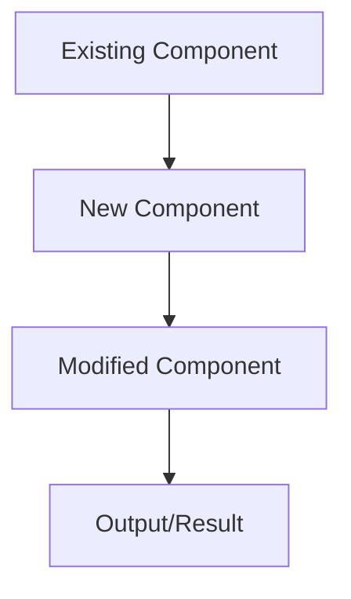
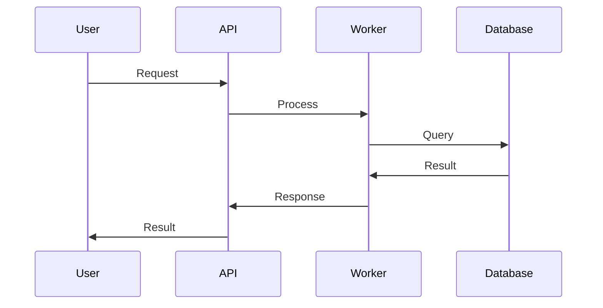

# TASK-XXX: [Task Name] - Technical Design

## Design Overview

### Architecture Decision
[High-level architectural approach and rationale]

### Design Principles
- **Principle 1**: Explanation and application
- **Principle 2**: Explanation and application
- **Principle 3**: Explanation and application

### Integration Strategy
[How this feature integrates with existing LocalRetrieve architecture]

## System Architecture

### Component Diagram


### Data Flow


## Detailed Design

### Core Components

#### Component 1: [Component Name]
**Purpose**: [What this component does]
**Location**: `src/path/to/component.ts`
**Responsibilities**:
- Responsibility 1
- Responsibility 2
- Responsibility 3

**Public Interface**:
```typescript
interface ComponentInterface {
  method1(param: Type): Promise<ReturnType>;
  method2(param: Type): ReturnType;
}
```

#### Component 2: [Component Name]
**Purpose**: [What this component does]
**Location**: `src/path/to/component.ts`
**Responsibilities**:
- Responsibility 1
- Responsibility 2

### Data Structures

#### Primary Data Types
```typescript
interface PrimaryDataType {
  field1: string;
  field2: number;
  field3: Optional<Type>;
}

type HelperType = 'value1' | 'value2' | 'value3';
```

#### Database Schema Changes
```sql
-- New tables or modifications
CREATE TABLE IF NOT EXISTS new_table (
  id INTEGER PRIMARY KEY,
  data TEXT NOT NULL,
  created_at INTEGER DEFAULT (strftime('%s', 'now'))
);

-- Indexes
CREATE INDEX idx_new_table_data ON new_table(data);
```

## Implementation Strategy

### Development Phases

#### Phase 1: Foundation (X hours)
- [ ] Set up basic structure
- [ ] Implement core interfaces
- [ ] Create basic tests

#### Phase 2: Core Implementation (Y hours)
- [ ] Implement main functionality
- [ ] Add error handling
- [ ] Integrate with existing components

#### Phase 3: Integration & Testing (Z hours)
- [ ] Full integration testing
- [ ] Performance optimization
- [ ] Documentation and examples

### File Changes

#### New Files
- `src/new/component.ts` - Main implementation
- `src/types/new-types.ts` - Type definitions
- `tests/unit/new-component.test.ts` - Unit tests

#### Modified Files
- `src/database/Database.ts` - Add new methods
- `src/database/worker.ts` - Worker integration
- `src/types/database.ts` - Type updates

#### Configuration Changes
- `package.json` - New dependencies (if any)
- `tsconfig.json` - Path updates (if needed)

## Error Handling Strategy

### Error Types
```typescript
class NewFeatureError extends Error {
  constructor(message: string, public code: string) {
    super(message);
    this.name = 'NewFeatureError';
  }
}
```

### Error Scenarios
- **Scenario 1**: How to handle and recover
- **Scenario 2**: How to handle and recover
- **Scenario 3**: How to handle and recover

### Fallback Strategies
- **Primary Strategy**: Normal operation
- **Fallback 1**: When primary fails
- **Fallback 2**: When fallback 1 fails

## Performance Considerations

### Performance Targets
- **Target Metric 1**: Specific target and measurement
- **Target Metric 2**: Specific target and measurement
- **Target Metric 3**: Specific target and measurement

### Optimization Strategies
- **Strategy 1**: Implementation approach
- **Strategy 2**: Implementation approach
- **Strategy 3**: Implementation approach

### Memory Management
- **Allocation Strategy**: How memory is managed
- **Cleanup Strategy**: How resources are cleaned up
- **Monitoring**: How to monitor resource usage

## Testing Strategy

### Unit Testing
- **Component Tests**: What to test at component level
- **Integration Tests**: What to test at integration level
- **Mock Strategy**: What to mock and how

### Test Cases
```typescript
describe('New Feature', () => {
  test('should handle normal case', () => {
    // Test implementation
  });

  test('should handle error case', () => {
    // Test implementation
  });
});
```

### Performance Testing
- **Load Testing**: How to test under load
- **Stress Testing**: How to test limits
- **Benchmark Testing**: How to measure performance

## Security Considerations

### Security Requirements
- **Data Protection**: How sensitive data is protected
- **Input Validation**: How inputs are validated
- **Access Control**: How access is controlled

### Security Implementation
- **Validation Strategy**: Input validation approach
- **Sanitization**: Data sanitization approach
- **Error Handling**: Secure error handling

## Migration Strategy

### Backward Compatibility
- **API Compatibility**: How existing APIs remain compatible
- **Data Migration**: How existing data is migrated
- **Deprecation Path**: How old features are deprecated

### Migration Steps
1. **Step 1**: Preparation and setup
2. **Step 2**: Core implementation
3. **Step 3**: Migration and testing

### Rollback Plan
- **Rollback Triggers**: When to rollback
- **Rollback Process**: How to rollback
- **Data Recovery**: How to recover data

## Documentation Requirements

### API Documentation
- **New APIs**: Documentation for new APIs
- **Changed APIs**: Documentation for changed APIs
- **Examples**: Code examples needed

### User Documentation
- **User Guide Updates**: What user documentation needs updating
- **Examples**: User examples needed
- **Tutorials**: Tutorials that need creation/updates

### Technical Documentation
- **Architecture Docs**: What architecture documentation needs updating
- **Implementation Docs**: What implementation documentation is needed
- **Troubleshooting**: What troubleshooting guides are needed

## Dependencies and Integration

### Internal Dependencies
- **Dependency 1**: How this depends on other components
- **Dependency 2**: How this depends on other components

### External Dependencies
- **Library 1**: Why needed and how used
- **Library 2**: Why needed and how used

### Integration Points
- **Integration 1**: How this integrates with existing systems
- **Integration 2**: How this integrates with existing systems

## Alternative Approaches

### Approach 1: [Alternative Name]
**Pros**: Benefits of this approach
**Cons**: Drawbacks of this approach
**Rationale**: Why not chosen

### Approach 2: [Alternative Name]
**Pros**: Benefits of this approach
**Cons**: Drawbacks of this approach
**Rationale**: Why not chosen

### Selected Approach: [Chosen Name]
**Pros**: Benefits of chosen approach
**Implementation**: Why this approach was selected
**Trade-offs**: What trade-offs were made