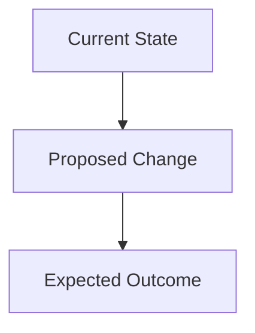

# TASK-XXX: Название Задачи

## Контекст и Обоснование
**Проблема**: Краткое описание проблемы или потребности
**Цель**: Что мы хотим достичь
**Связь с архитектурой**: Ссылки на /doc/target_architecture.md

## Критерии Приемки (BDD-стиль)
- **Дано** начальное состояние
- **Когда** выполняется действие
- **Тогда** ожидаемый результат

## Техническое Планирование

### Компоненты для Изменения
- `src/path/file.ts` - описание изменений
- `tests/unit/test.ts` - новые тесты
- `examples/demo.js` - обновления демо

### Архитектурное Решение


### API Изменения
```typescript
// Новые или изменяемые интерфейсы
interface NewFeature {
  method(): Promise<Result>;
}
```

## План Реализации

### Этапы
1. **Подготовка** (X часов)
   - Настройка среды разработки
   - Изучение существующего кода

2. **Основная разработка** (Y часов)
   - Реализация ключевой функциональности
   - Написание тестов

3. **Интеграция и тестирование** (Z часов)
   - Интеграция с существующим кодом
   - Обновление демо и документации

### Потенциальные Риски
- **Риск 1**: Описание и план митигации
- **Риск 2**: Описание и план митигации

## Критерии Готовности (Definition of Done)
- [ ] Код написан и соответствует стандартам
- [ ] Юнит-тесты добавлены и проходят
- [ ] Интеграционные тесты обновлены
- [ ] Демо-приложение работает корректно
- [ ] Документация обновлена
- [ ] Код-ревью завершен
- [ ] Нет регрессий в существующей функциональности

## Связанные Задачи
- Зависит от: TASK-XXX
- Блокирует: TASK-YYY
- Связано с: /doc/vision.md секция X

## Оценка
**Сложность**: High/Medium/Low
**Оценка времени**: X дней
**Приоритет**: Critical/High/Medium/Low

## Статус
- [ ] Не начато
- [ ] В работе
- [ ] Код-ревью
- [ ] Готово к тестированию
- [ ] Завершено

## История изменений
- YYYY-MM-DD: Создание тикета
- YYYY-MM-DD: Начало разработки
- YYYY-MM-DD: Завершение